# ALAA — High-Level Design (HLD)

> **Status**: MVP Complete. Currently executing **Phase 2** (Production Extensions & Scalability).

## 1. Module Overview

The system is composed of seven core modules plus a **plug-and-play adapter layer** (Phase 2). Each module is a self-contained unit with clear interfaces.

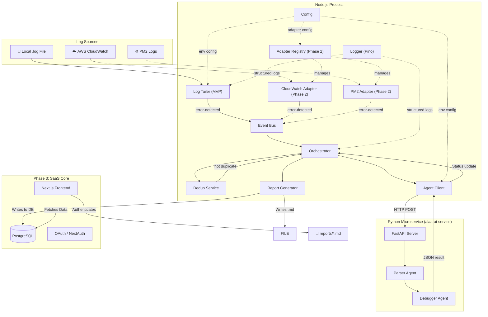

---

## 2. Module Specifications

### 2.1 Config Module (`src/config/index.ts`)

Loads and validates all environment variables at startup. Uses `dotenv` for `.env` file loading and provides typed configuration.

| Setting | Env Var | Default | Description |
|---------|---------|---------|-------------|
| Log file path | `LOG_FILE_PATH` | `./system.log` | Path to the log file to watch |
| Report output dir | `REPORT_DIR` | `./reports` | Directory for generated reports |
| Dedup TTL (ms) | `DEDUP_TTL_MS` | `300000` (5 min) | Time window for error deduplication |
| CrewAI mode | `CREWAI_MODE` | `subprocess` | `subprocess` or `http` |
| CrewAI host | `CREWAI_HOST` | `http://localhost:8000` | Host for HTTP mode |
| Ollama model | `OLLAMA_MODEL` | `llama3` | Ollama model name (e.g., `llama3`, `codellama`, `mistral`) |
| Ollama base URL | `OLLAMA_BASE_URL` | `http://localhost:11434` | Ollama server endpoint |
| Log level | `LOG_LEVEL` | `info` | Pino log level |

**Validation:**
- Startup fails fast if Ollama is unreachable at `OLLAMA_BASE_URL`.
- Startup fails fast if `LOG_FILE_PATH` doesn't exist.

---

### 2.2 Log Tailer Module (`src/tailer/LogTailer.ts`)

The **MVP's concrete log source** — watches a local `.log` file and detects new error blocks. Implements the `LogSource` interface (see §2.8), making it interchangeable with cloud adapters in Phase 2.

#### Interfaces

```
Input:  filePath (string) — absolute path to the log file
Output: Emits "error-detected" events with ErrorBlock payloads
```

#### Behavior

1. **Start** — Open the file, seek to the end (only process new lines).
2. **Watch** — Use `fs.watch()` to detect file changes. On change, read new lines using `readline` on a stream starting from the last known byte offset.
3. **Detect** — Match lines containing `ERROR` or `Exception` (case-insensitive regex).
4. **Aggregate** — Collect the error line plus up to 10 preceding context lines (circular buffer) into an `ErrorBlock`.
5. **Emit** — Publish the `ErrorBlock` to the Event Bus.
6. **Offset Tracking** — Persist the current byte offset in memory (Phase 2: to file/Redis for crash recovery).

#### Error Handling

| Scenario | Strategy |
|----------|----------|
| File deleted | Log warning, attempt reconnect with exponential backoff (max 5 retries) |
| File rotated | Detect truncation (new size < offset), reset offset to 0 |
| Permission denied | Fatal error — log and exit |

---

### 2.3 Event Bus Module (`src/events/EventBus.ts`)

A singleton wrapper around Node.js `EventEmitter` with typed events.

#### Events

| Event Name | Payload | Description |
|------------|---------|-------------|
| `error-detected` | `ErrorBlock` | Raw error block from log tailer |
| `analysis-complete` | `AnalysisResult` | Completed analysis from agents |
| `report-generated` | `ReportMeta` | Report file path + metadata |
| `processing-error` | `ProcessingError` | Pipeline failure details |

#### Safeguards
- Max listeners set to 20 (with warning on exceeded).
- Unhandled error events are caught and logged (never crash the process).

---

### 2.4 Orchestrator Module (`src/orchestrator/Orchestrator.ts`)

Central coordinator — receives `error-detected` events, manages the processing pipeline, and handles deduplication.

#### Pipeline Flow

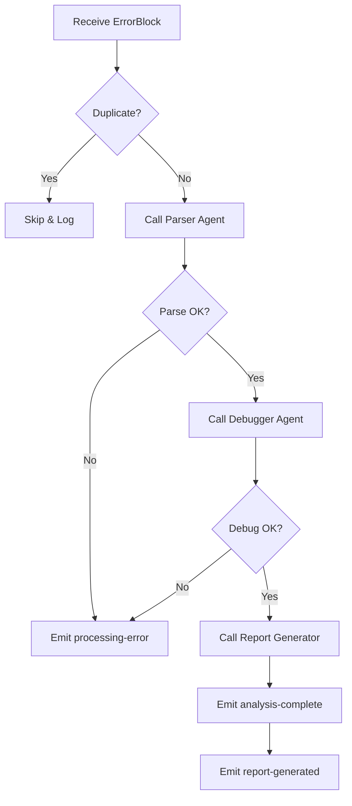

#### Deduplication Strategy

- Delegated to `IDedupService` (default `InMemoryDedupService`).
- Computes a hash of the error signature (error type + message).
- Stores `hash → timestamp`.
- Skips if the same hash was seen within `DEDUP_TTL_MS`.

#### Concurrency
- MVP: sequential processing (one error at a time).
- Phase 2: BullMQ workers with configurable concurrency.

---

### 2.5 Agent Client Module (`src/agents/ SubprocessAgentClient.ts`)

Implements the `IAgentClient` interface to adapt between the Node.js orchestrator and the Python CrewAI service. Using an interface allows swapping to HTTP/gRPC later without changing Orchestrator logic.

#### Subprocess Mode (MVP)
*Deprecated in Phase 8. Replaced by FastApi microservice.*

#### HTTP Mode (Phase 2)

```
POST /api/parse   → { rawBlock: string }  → { parsedError: ParsedError }
POST /api/debug   → { parsedError: ParsedError } → { diagnosis: Diagnosis }
GET  /api/health  → { status: "ok" }
```

#### Retry Policy

| Attempt | Wait | Notes |
|---------|------|-------|
| 1 | 0 s | Immediate |
| 2 | 2 s | First retry |
| 3 | 5 s | Final retry |
| — | — | Give up, emit `processing-error` |

---

### 2.6 CrewAI Service (`alaa-ai-service/`)

Standalone Python FastAPI microservice implementing the multi-agent AI pipeline.

#### Agent Definitions

##### Parser Agent
- **Role:** Log Error Parser
- **Goal:** Clean raw log data, strip noise, extract the core error signature.
- **Backstory:** Senior SRE who has parsed millions of stack traces.
- **Tools:** None (pure LLM reasoning).

##### Debugger Agent
- **Role:** Root Cause Analyst & Code Fixer
- **Goal:** Analyze the parsed error, identify root cause, propose a specific code fix.
- **Backstory:** Staff engineer with deep debugging expertise across the full stack.
- **Tools:** None for MVP. Phase 2: web search tool for known issues.

#### Task Chain

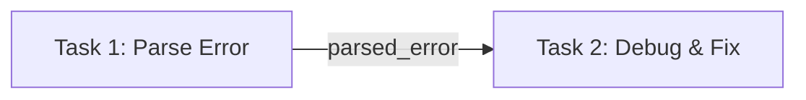

- **Task 1 (Parse):** Takes raw log block, outputs structured `ParsedError` (error type, message, stack frames, context).
- **Task 2 (Debug):** Takes `ParsedError`, outputs `Diagnosis` (root cause explanation, suggested fix with code, severity, confidence score).

#### LLM Configuration (MVP — Ollama Only)
- **Provider:** Ollama (self-hosted). No API key required.
- **Model:** Configurable via `OLLAMA_MODEL` env var (default: `llama3`). Recommended: `llama3`, `codellama`, `mistral`, `deepseek-r1`.
- **Base URL:** Configurable via `OLLAMA_BASE_URL` (default: `http://localhost:11434`).
- **Temperature:** 0.1 (deterministic/factual output).
- **Max tokens:** 2000.
- Phase 2 adds multi-provider support (OpenAI, Anthropic, Google). See §2.9.

---

### 2.7 Report Generator Module (`src/reporter/ReportGenerator.ts`)

Transforms an `AnalysisResult` into a formatted Markdown file.

#### Report Template

```markdown
# 🔴 Error Diagnostic Report

**Generated:** {timestamp}
**Source:** {logFilePath}
**Severity:** {severity}
**Confidence:** {confidence}%

---

## Error Summary
{errorType}: {errorMessage}

## Stack Trace (Cleaned)
{formattedStackTrace}

## Root Cause Analysis
{rootCauseExplanation}

## Proposed Fix
```{language}
{proposedCodeFix}
```

## Additional Notes
{additionalNotes}
```

#### File Naming
- Pattern: `reports/{timestamp}_{errorType}.md`
- Example: `reports/2026-02-21T15-02-06_ECONNREFUSED.md`

---

### 2.8 Log Source Adapter — Plug & Play System (Phase 2)

A **plugin architecture** that allows users to swap or combine log sources without touching any downstream code. The Orchestrator and Event Bus remain unchanged — any adapter that implements the `LogSource` interface can feed errors into the pipeline.

#### Core Concept

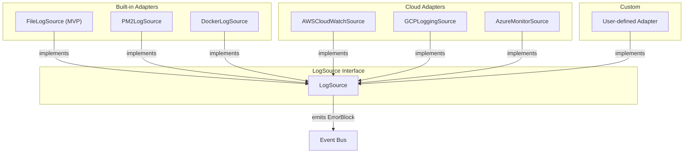

#### `LogSource` Interface Contract

Every adapter must implement this interface:

```
interface LogSource {
  name: string                          // Unique adapter identifier
  start(): Promise<void>                // Begin watching / polling
  stop(): Promise<void>                 // Graceful cleanup
  onError(handler: (block: ErrorBlock) => void): void  // Register callback
  healthCheck(): Promise<HealthStatus>  // Connection status
}
```

#### Planned Adapters

| Adapter | Source | Connection Method | Config Required |
|---------|--------|-------------------|-----------------|
| **FileLogSource** | Local `.log` files | `fs.watch` + `readline` | `filePath` |
| **PM2LogSource** | PM2 process logs | PM2 programmatic API / `~/.pm2/logs/` | `pm2Home`, `appName` |
| **DockerLogSource** | Docker container logs | Docker Engine API (`/containers/{id}/logs`) | `containerId`, `dockerSocket` |
| **AWSCloudWatchSource** | AWS CloudWatch Logs | AWS SDK `FilterLogEvents` polling | `logGroupName`, `region`, AWS credentials |
| **GCPLoggingSource** | Google Cloud Logging | GCP SDK `logging.entries.list` polling | `projectId`, `filter`, GCP credentials |
| **AzureMonitorSource** | Azure Monitor Logs | Azure SDK Log Analytics query | `workspaceId`, Azure credentials |
| **CustomWebhookSource** | Any external system | HTTP webhook receiver (POST endpoint) | `port`, `authToken` |

#### Adapter Registry

A central registry manages adapter lifecycle:

```
AdapterRegistry
  ├── register(name, AdapterClass)    // Register an adapter type
  ├── create(name, config)            // Instantiate from config
  ├── startAll()                      // Start all configured adapters
  ├── stopAll()                       // Graceful shutdown
  └── healthCheckAll()                // Status of all adapters
```

#### Configuration — `alaa.config.yaml`

Users configure their log sources via a YAML config file:

```yaml
# alaa.config.yaml
logSources:
  # Local file (MVP — always available)
  - type: file
    config:
      path: ./logs/app.log
      errorPatterns:
        - "ERROR"
        - "Exception"

  # PM2 logs from a Node.js app
  - type: pm2
    config:
      appName: my-api-server
      pm2Home: ~/.pm2

  # AWS CloudWatch
  - type: aws-cloudwatch
    config:
      logGroupName: /ecs/my-service
      region: us-east-1
      pollIntervalMs: 5000
      # AWS credentials via env vars or IAM role

  # Docker container logs
  - type: docker
    config:
      containerId: abc123def456
      follow: true

  # Custom webhook (receive logs via HTTP POST)
  - type: webhook
    config:
      port: 9090
      authToken: ${WEBHOOK_AUTH_TOKEN}
```

#### Adapter Lifecycle

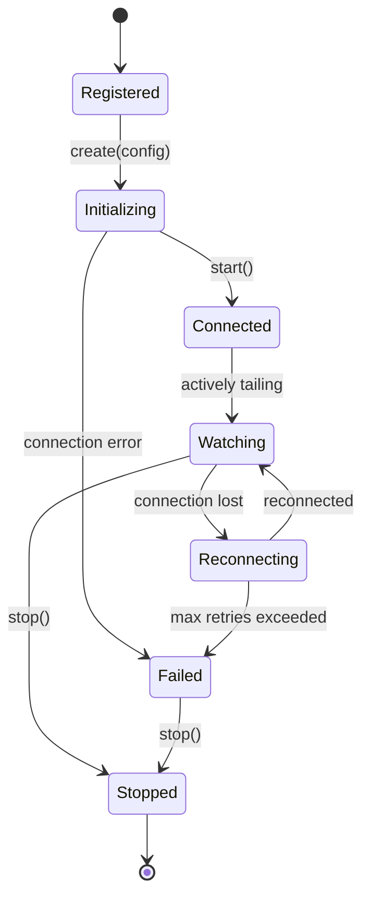

#### User Experience

1. **Install ALAA** → out-of-the-box file tailing works immediately.
2. **Connect to PM2** → add a `pm2` entry in `alaa.config.yaml`, restart ALAA.
3. **Connect to AWS** → `npm install @alaa/adapter-cloudwatch`, add config, restart.
4. **Build custom adapter** → implement `LogSource` interface, register in config.

> **Key principle:** The downstream pipeline (Orchestrator → Agents → Reports) is entirely agnostic to where errors come from. All adapters normalize their output into the same `ErrorBlock` format.

---

### 2.9 LLM Provider System

#### MVP — Ollama (Self-Hosted)

The MVP uses **Ollama** exclusively — a free, self-hosted LLM runner. No API keys, no cloud dependencies, fully local.

**Prerequisites:** User must have [Ollama](https://ollama.com) installed and running with at least one model pulled.

```bash
# Install Ollama (macOS)
brew install ollama

# Pull a model
ollama pull llama3

# Start the server (runs on http://localhost:11434)
ollama serve
```

**MVP Configuration:**
```env
OLLAMA_MODEL=llama3
OLLAMA_BASE_URL=http://localhost:11434
```

**How it works in CrewAI:**
```python
from crewai import LLM

# MVP — direct Ollama connection
llm = LLM(
    model="ollama/llama3",
    base_url="http://localhost:11434",
    temperature=0.1,
    max_tokens=2000
)
```

**Recommended Models:**

| Model | Size | Best For | Speed |
|-------|------|----------|-------|
| `llama3` | 8B | General-purpose analysis | ⭐ Fast |
| `codellama` | 7B | Code-focused debugging | ⭐ Fast |
| `mistral` | 7B | Good balance of speed & quality | ⭐ Fast |
| `deepseek-r1` | 7B | Reasoning & code | ⚠️ Medium |
| `llama3:70b` | 70B | Highest quality analysis | 🐢 Slow |

---

#### Phase 2 — Multi-Provider Abstraction

In Phase 2, a **provider-agnostic LLM layer** will allow users to switch between cloud and self-hosted models.

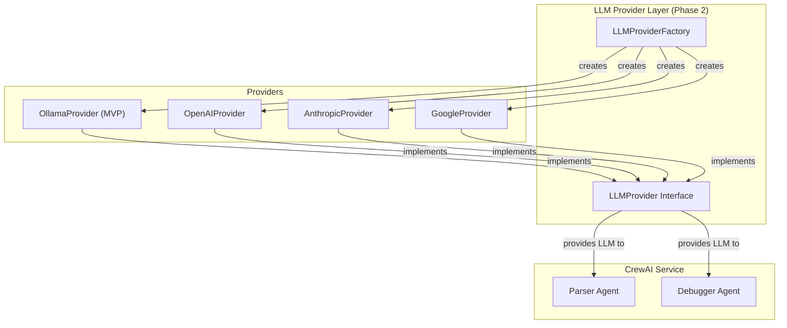

**Supported Providers (Phase 2):**

| Provider | `LLM_PROVIDER` | Example Models | API Key Required |
|----------|----------------|----------------|------------------|
| **Ollama** | `ollama` | `llama3`, `codellama`, `mistral` | No (self-hosted) |
| **OpenAI** | `openai` | `gpt-4o`, `gpt-4o-mini` | Yes |
| **Anthropic** | `anthropic` | `claude-sonnet-4-20250514`, `claude-3-5-haiku-20241022` | Yes |
| **Google** | `google` | `gemini-2.0-flash`, `gemini-2.5-pro` | Yes |

**Phase 2 Configuration (via env vars):**
```env
LLM_PROVIDER=anthropic
LLM_MODEL=claude-sonnet-4-20250514
LLM_API_KEY=sk-ant-...
```

**Phase 2 Advanced — Per-Agent Model Assignment (via `alaa.config.yaml`):**

```yaml
llm:
  default:
    provider: ollama
    model: llama3
  agents:
    parser:
      provider: ollama
      model: llama3        # Fast, cheap for structured extraction
    debugger:
      provider: anthropic
      model: claude-sonnet-4-20250514  # Powerful for complex reasoning
      apiKey: ${ANTHROPIC_API_KEY}
```

**Phase 2 Advanced — Fallback Chain:**

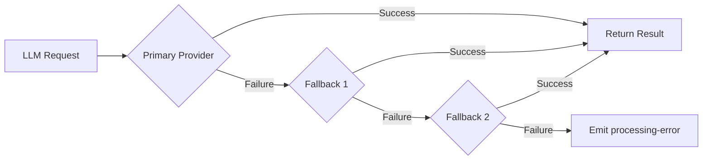

---

## 3. Data Models

### 3.1 Core Types

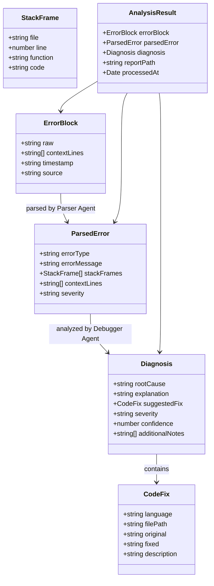

---

## 4. External Integrations

| Integration | Protocol | Purpose | MVP? |
|-------------|----------|---------|------|
| OpenAI API | HTTPS | LLM inference for agents | ✅ |
| File System | Native `fs` | Log watching + report writing | ✅ |
| Redis | TCP | BullMQ job store, dedup cache | ❌ Phase 2 |
| Slack API | HTTPS/Webhook | Report notifications | ❌ Phase 2 |
| AWS CloudWatch | AWS SDK | Cloud log ingestion | ❌ Phase 2 |
| GCP Logging | GCP SDK | Cloud log ingestion | ❌ Phase 2 |
| Azure Monitor | Azure SDK | Cloud log ingestion | ❌ Phase 2 |
| PM2 | Programmatic API | Process manager log access | ❌ Phase 2 |
| Docker Engine | REST API | Container log streaming | ❌ Phase 2 |

---

## 5. Error Handling & Logging Strategy

### 5.1 Error Categories

| Category | Example | Response |
|----------|---------|----------|
| **Fatal** | Missing API key, permission denied | Log → Exit with code 1 |
| **Transient** | LLM timeout, file temporarily unavailable | Retry with backoff → emit `processing-error` |
| **Logical** | LLM returns malformed JSON | Log warning → skip this error → continue |
| **Operational** | File rotated, disk full | Log warning → adapt (reset offset / alert) |

### 5.2 Logging

- **Library:** [Pino](https://github.com/pinojs/pino) — fast, JSON-structured, low overhead.
- **Format:** JSON lines to stdout (pipe to file or log aggregator as needed).
- **Fields:** `timestamp`, `level`, `module`, `message`, `errorId` (correlation ID).
- **Levels:** `fatal`, `error`, `warn`, `info`, `debug`, `trace`.

```json
{
  "level": 30,
  "time": 1740150126000,
  "module": "orchestrator",
  "errorId": "abc123",
  "msg": "Parser agent completed successfully"
}
```

---

## 6. Process Lifecycle

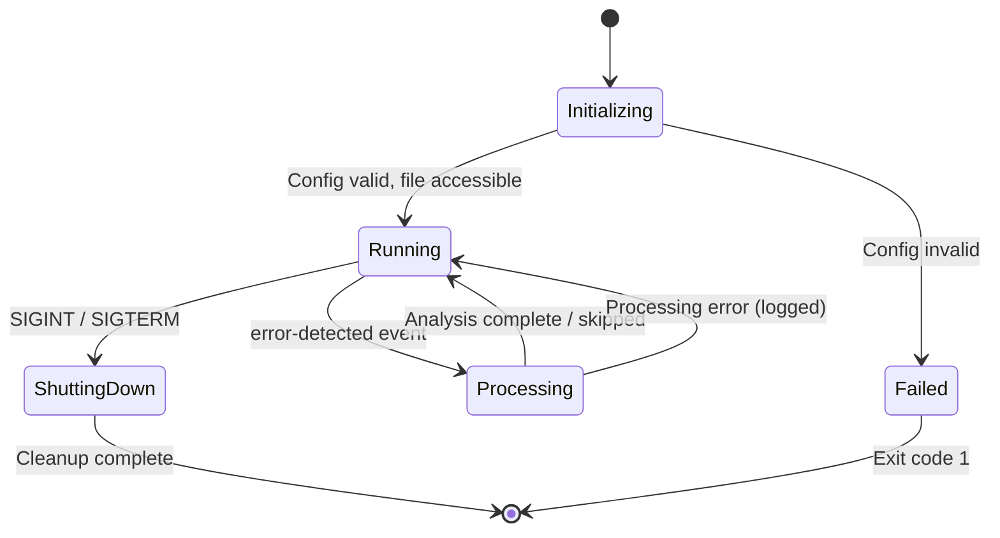

### Graceful Shutdown
1. Stop Log Tailer (close file watcher).
2. Wait for in-flight processing to complete (max 30s timeout).
3. Flush logger buffers.
4. Exit with code 0.

---

## 7. Non-Functional Requirements

| Requirement | Target | Approach |
|-------------|--------|----------|
| **Latency** | Analysis < 30s per error | Streaming I/O, efficient prompts, fast LLM model |
| **Memory** | < 100 MB RSS | Stream-based file reading, bounded dedup map |
| **Reliability** | No error lost | Offset tracking, retry logic, graceful shutdown |
| **Testability** | > 80% coverage | Dependency injection, mockable interfaces |
| **Security** | No secrets in logs | Env-var secrets, Pino redaction |

---

## 8. Testing Strategy

| Layer | Tool | What |
|-------|------|------|
| Unit | Jest/Vitest | Individual modules with mocked dependencies |
| Integration | Jest + test fixtures | End-to-end pipeline with fixture log files |
| Manual | Sample log file | Append errors to `system.log` and verify reports |

---

## 9. Next Steps

Upon approval of this HLD:
1. **LLD** — TypeScript interfaces, class implementations, function signatures, CrewAI agent definitions in Python.
2. **MVP Plan** — Feature prioritization, timeline, risks, and roadmap to production.

---

## 10. Phase 3: SaaS Expansion Modules

To transform ALAA into a multi-tenant product, the following new modules are introduced:

### 10.1 Next.js Frontend Dashboard (`frontend/`)
A React-based web interface built on Next.js 14+ (App Router). 
- **User Authentication:** Login/Signup flows.
- **Log Source Configuration:** UI to add integrations (e.g., provide AWS CloudWatch credentials or PM2 stream endpoints).
- **Report Viewer:** Rich UI for displaying Markdown reports interactively.
- **Billing Portal:** Subscription management.

### 10.2 Database Layer (`models/` via Prisma)
PostgreSQL handles persistent state, accessed via Prisma ORM.
- **User schema:** OAuth credentials, email, preferences.
- **Workspace schema:** Organizations for teams to share logs.
- **LogSource schema:** Encrypted API keys and config for active adapters.
- **Report schema:** The JSON/Text output of the Orchestrator for historical tracking.

### 10.3 Auth & Permissions (`middleware/`)
Token-based access control protecting the dashboard and backend APIs.
- NextAuth.js for frontend side sessions (OAuth via GitHub/Google).
- JWT bearer tokens for external backend API access (if providing CLI tools to SaaS users).

### 10.4 Billing API Integrations
Webhooks listening to Stripe for subscription tier enforcement.
- Pro tier unlocks advanced GPT-4 / Claude-3 Opus models.
- Free tier restricts to generic local Llama models or fewer log ingestions per day.

---

## 11. Phase 10: Multi-Agent Model Assignments & Fallbacks

> **Scope**: Upgrades to the `alaa-ai-service` Python layer and relevant Node.js config/client code only. No other modules are affected.

### 11.1 Motivation

Currently, both the Parser Agent and the Debugger Agent share a single LLM instance passed from the Node.js backend. This is sub-optimal:
- The **Parser Agent** only needs fast, cheap structured extraction — ideal for a lightweight model.
- The **Debugger Agent** demands deep code reasoning — benefits greatly from a premium model.

Additionally, a single model point-of-failure means any downtime blocks the entire pipeline.

### 11.2 Architecture: Multi-Provider Config Flow

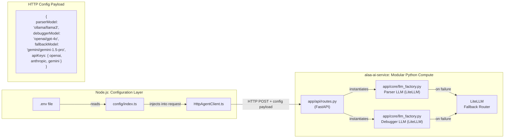

### 11.3 Supported LLM Providers

ALAA uses **LiteLLM** as the universal model abstraction layer. By simply editing `.env`, users can route requests to any leading provider:

| Provider | Example Model String | Required Secret |
|----------|---------------------|-----------------|
| **Ollama (local)** | `ollama/llama3`, `ollama/codellama` | None (local) |
| **OpenAI** | `openai/gpt-4o`, `openai/gpt-3.5-turbo` | `OPENAI_API_KEY` |
| **Anthropic** | `anthropic/claude-3-5-sonnet-20240620` | `ANTHROPIC_API_KEY` |
| **Google Gemini** | `gemini/gemini-1.5-pro`, `gemini/gemini-flash` | `GEMINI_API_KEY` |

### 11.4 Environment Configuration

New variables added to `.env`:

```env
# Per-Agent Model Assignments (LiteLLM prefix format)
PARSER_LLM_MODEL=ollama/llama3          # Fast/cheap for extraction
DEBUGGER_LLM_MODEL=openai/gpt-4o       # Powerful for reasoning
FALLBACK_LLM_MODEL=gemini/gemini-1.5-pro  # Fallback if primary fails

# Provider API Keys (only required if using that provider)
OPENAI_API_KEY=
ANTHROPIC_API_KEY=
GEMINI_API_KEY=
```

### 11.5 Config Payload Contract

The Node.js `HttpAgentClient` will extend its request body with a `config` object containing all model and key info:

```typescript
interface AgentConfig {
  parserModel: string;       // e.g. "ollama/llama3"
  debuggerModel: string;     // e.g. "openai/gpt-4o"
  fallbackModel: string;     // e.g. "gemini/gemini-1.5-pro"
  apiKeys: {
    openai?: string;
    anthropic?: string;
    gemini?: string;
  };
}
```

The Python FastAPI service reads this payload to instantiate **two separate** LiteLLM-backed LLM objects — one per agent — and configures the fallback chain prior to running the CrewAI pipeline.

### 11.6 Fallback Chain Flow

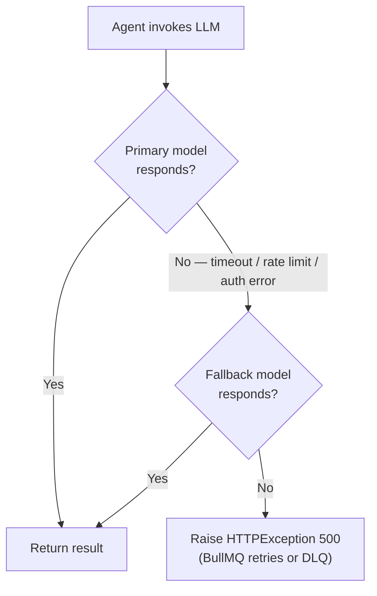


---

## 12. Phase 11: Omni-Channel Log Ingestion

> **Status**: Approved. Ready for implementation.

### 12.1 Overview

Phase 11 implements the adapter stubs created in Phase 7 (§2.8) by building three concrete log source adapters:

| Adapter | Category | Transport | npm Dependency |
|---------|----------|-----------|----------------|
| **WebhookLogSource** | Push | HTTP POST receiver | `express` (already in ecosystem) |
| **DockerLogSource** | Pull | Docker Engine API stream | `dockerode` |
| **PM2LogSource** | Pull | PM2 IPC Bus | `pm2` |

All adapters implement the existing `ILogSource` interface and emit `ErrorBlock` payloads to the `EventBus`. The downstream pipeline (Orchestrator → Agents → Reports) remains completely unmodified.

### 12.2 Webhook Ingestion Architecture (Push Model)

Cloud providers (AWS CloudWatch, GCP Cloud Logging, Azure Monitor) do **not** stream continuous logs. Instead, they use **Metric Filters** to detect error patterns natively, then fire a single HTTP POST (webhook) containing only the error payload to ALAA's endpoint.

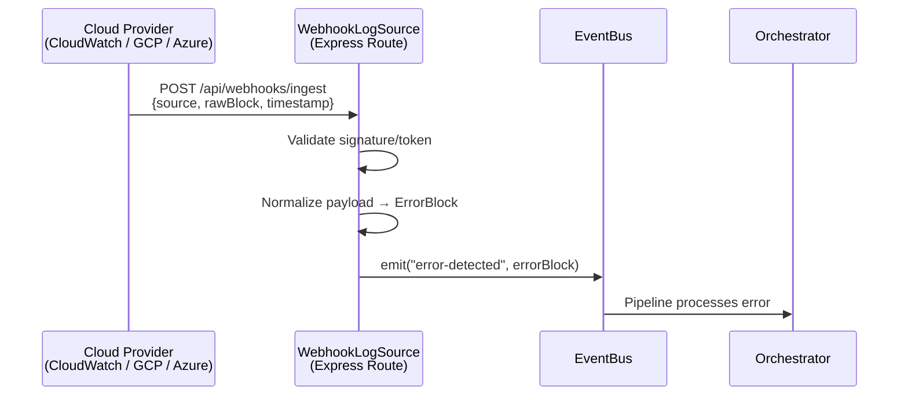

**Endpoint:** `POST /api/webhooks/ingest`
- **Auth:** `x-webhook-secret` header validated against `WEBHOOK_SECRET_KEY` env var.
- **Payload Schema:** Accepts a generic JSON body with `source`, `rawBlock`, and optional `timestamp`.
- **Cloud Translators:** Internal middleware functions that normalize AWS SNS, GCP Pub/Sub, and Azure Action Group payloads into the generic schema.

### 12.3 Docker Log Streaming Architecture (Pull Model)

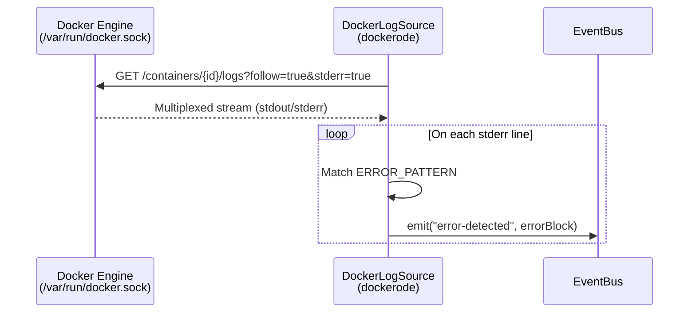

### 12.4 PM2 Bus Architecture (Pull Model)

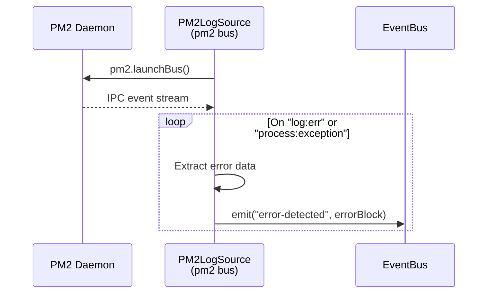

### 12.5 Configuration Extensions

New environment variables:

| Variable | Default | Description |
|----------|---------|-------------|
| `ENABLE_DOCKER_SOURCE` | `false` | Enable Docker log streaming |
| `ENABLE_PM2_SOURCE` | `false` | Enable PM2 bus listening |
| `ENABLE_WEBHOOK_SOURCE` | `false` | Enable webhook ingestion endpoint |
| `WEBHOOK_PORT` | `9090` | Port for the webhook HTTP server |
| `WEBHOOK_SECRET_KEY` | _(required if enabled)_ | Secret for validating incoming webhooks |
| `DOCKER_CONTAINER_NAMES` | `""` | Comma-separated container names to monitor |
| `PM2_PROCESS_NAMES` | `""` | Comma-separated PM2 process names to monitor |

---
*Navigation: [← 03_mvp_plan.md](./03_mvp_plan.md) | [Main Index](../README.md#📚-architecture-documentation-index) | [Next Document →](./05_low_level_design.md)*
