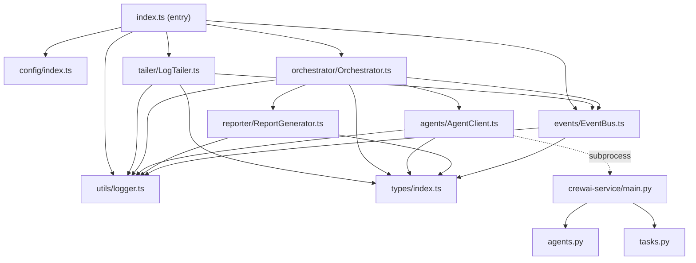

# ALAA — Low-Level Design (LLD)

> **Scope:** Phase 1 (MVP) only. This document provides implementation-level specifications for every module.

---

## 1. Project Setup

### 1.1 Dependencies

**Node.js (`package.json`):**
```json
{
  "name": "alaa",
  "version": "0.1.0",
  "description": "Agentic Log Analyzer & Auto-Fixer",
  "main": "dist/index.js",
  "scripts": {
    "dev": "tsx watch src/index.ts",
    "build": "tsc",
    "start": "node dist/index.js",
    "test": "vitest",
    "test:coverage": "vitest --coverage",
    "lint": "eslint src/"
  },
  "dependencies": {
    "dotenv": "^16.4.0",
    "pino": "^9.0.0",
    "pino-pretty": "^11.0.0"
  },
  "devDependencies": {
    "@types/node": "^22.0.0",
    "tsx": "^4.7.0",
    "typescript": "^5.5.0",
    "vitest": "^2.0.0",
    "eslint": "^9.0.0",
    "@typescript-eslint/eslint-plugin": "^8.0.0"
  }
}
```

**Python (`src/agents/crewai-service/requirements.txt`):**
```
crewai>=0.86.0
crewai-tools>=0.14.0
```

### 1.2 TypeScript Config

```json
{
  "compilerOptions": {
    "target": "ES2022",
    "module": "Node16",
    "moduleResolution": "Node16",
    "lib": ["ES2022"],
    "outDir": "./dist",
    "rootDir": "./src",
    "strict": true,
    "esModuleInterop": true,
    "skipLibCheck": true,
    "forceConsistentCasingInFileNames": true,
    "resolveJsonModule": true,
    "declaration": true,
    "declarationMap": true,
    "sourceMap": true
  },
  "include": ["src/**/*"],
  "exclude": ["node_modules", "dist", "**/*.test.ts"]
}
```

### 1.3 Environment File (`.env.example`)

```env
# Log Watcher
LOG_FILE_PATH=./system.log
REPORT_DIR=./reports

# Deduplication
DEDUP_TTL_MS=300000

# CrewAI
CREWAI_MODE=subprocess

# Ollama
OLLAMA_MODEL=llama3
OLLAMA_BASE_URL=http://localhost:11434

# Logging
LOG_LEVEL=info
```

---

## 2. Type Definitions (`src/types/index.ts`)

All shared types used across modules.

```typescript
// ─── Error Block (from Log Tailer) ─────────────────────────────

export interface ErrorBlock {
  /** The raw error line from the log */
  raw: string;
  /** Surrounding context lines (up to 10 preceding lines) */
  contextLines: string[];
  /** ISO 8601 timestamp extracted from the log line */
  timestamp: string;
  /** Source file path being watched */
  source: string;
  /** Unique ID for correlation across pipeline stages */
  id: string;
}

// ─── Parsed Error (from Parser Agent) ──────────────────────────

export interface ParsedError {
  /** Type of error (e.g., "ECONNREFUSED", "TimeoutError") */
  errorType: string;
  /** Human-readable error message */
  errorMessage: string;
  /** Parsed stack frames, if available */
  stackFrames: StackFrame[];
  /** Cleaned context lines */
  contextLines: string[];
  /** Severity: "critical" | "high" | "medium" | "low" */
  severity: ErrorSeverity;
}

export interface StackFrame {
  /** File path referenced in the stack trace */
  file: string;
  /** Line number */
  line: number;
  /** Function or method name */
  functionName: string;
  /** Code snippet at that line, if available */
  code?: string;
}

export type ErrorSeverity = "critical" | "high" | "medium" | "low";

// ─── Diagnosis (from Debugger Agent) ───────────────────────────

export interface Diagnosis {
  /** Root cause explanation */
  rootCause: string;
  /** Detailed analysis of why the error occurred */
  explanation: string;
  /** Proposed code fix */
  suggestedFix: CodeFix;
  /** Severity assessment */
  severity: ErrorSeverity;
  /** Confidence score (0-100) */
  confidence: number;
  /** Additional notes or recommendations */
  additionalNotes: string[];
}

export interface CodeFix {
  /** Programming language of the fix */
  language: string;
  /** File path that needs the fix (if identifiable) */
  filePath?: string;
  /** Original problematic code */
  original?: string;
  /** Fixed code */
  fixed: string;
  /** Description of what the fix does */
  description: string;
}

// ─── Analysis Result (complete pipeline output) ────────────────

export interface AnalysisResult {
  /** Original error block */
  errorBlock: ErrorBlock;
  /** Parsed error from Parser Agent */
  parsedError: ParsedError;
  /** Diagnosis from Debugger Agent */
  diagnosis: Diagnosis;
  /** Path to generated report file */
  reportPath: string;
  /** When the analysis was completed */
  processedAt: Date;
}

// ─── Event Payloads ────────────────────────────────────────────

export interface ReportMeta {
  /** Path to the generated report */
  filePath: string;
  /** Error ID for correlation */
  errorId: string;
  /** Timestamp of report generation */
  generatedAt: Date;
}

export interface ProcessingError {
  /** Error ID for correlation */
  errorId: string;
  /** Which pipeline stage failed */
  stage: "parse" | "debug" | "report";
  /** Error message */
  message: string;
  /** Original error object */
  error: Error;
}

// ─── Config ────────────────────────────────────────────────────

export interface AppConfig {
  logFilePath: string;
  reportDir: string;
  dedupTtlMs: number;
  crewaiMode: "subprocess" | "http";
  crewaiHost: string;
  ollamaModel: string;
  ollamaBaseUrl: string;
  logLevel: string;
}

// ─── Event Map (for typed EventEmitter) ────────────────────────

export interface EventMap {
  "error-detected": ErrorBlock;
  "analysis-complete": AnalysisResult;
  "report-generated": ReportMeta;
  "processing-error": ProcessingError;
}
```

---

## 3. Config Module (`src/config/index.ts`)

```typescript
import dotenv from "dotenv";
import path from "node:path";
import fs from "node:fs";
import type { AppConfig } from "../types/index.js";

export function loadConfig(): AppConfig {
  dotenv.config();

  const config: AppConfig = {
    logFilePath: path.resolve(process.env.LOG_FILE_PATH ?? "./system.log"),
    reportDir: path.resolve(process.env.REPORT_DIR ?? "./reports"),
    dedupTtlMs: parseInt(process.env.DEDUP_TTL_MS ?? "300000", 10),
    crewaiMode: (process.env.CREWAI_MODE as "subprocess" | "http") ?? "subprocess",
    crewaiHost: process.env.CREWAI_HOST ?? "http://localhost:8000",
    ollamaModel: process.env.OLLAMA_MODEL ?? "llama3",
    ollamaBaseUrl: process.env.OLLAMA_BASE_URL ?? "http://localhost:11434",
    logLevel: process.env.LOG_LEVEL ?? "info",
  };

  validate(config);
  return config;
}

function validate(config: AppConfig): void {
  // Check log file exists
  if (!fs.existsSync(config.logFilePath)) {
    throw new Error(`LOG_FILE_PATH does not exist: ${config.logFilePath}`);
  }

  // Ensure report directory exists (create if not)
  if (!fs.existsSync(config.reportDir)) {
    fs.mkdirSync(config.reportDir, { recursive: true });
  }

  // Validate numeric config
  if (isNaN(config.dedupTtlMs) || config.dedupTtlMs < 0) {
    throw new Error(`Invalid DEDUP_TTL_MS: ${config.dedupTtlMs}`);
  }

  // Validate CrewAI mode
  if (!["subprocess", "http"].includes(config.crewaiMode)) {
    throw new Error(`Invalid CREWAI_MODE: ${config.crewaiMode}`);
  }
}
```

---

## 4. Logger (`src/utils/logger.ts`)

```typescript
import pino from "pino";
import type { AppConfig } from "../types/index.js";

let logger: pino.Logger;

export function createLogger(config: Pick<AppConfig, "logLevel">): pino.Logger {
  logger = pino({
    level: config.logLevel,
    transport: {
      target: "pino-pretty",
      options: {
        colorize: true,
        translateTime: "SYS:HH:MM:ss.l",
        ignore: "pid,hostname",
      },
    },
  });
  return logger;
}

export function getLogger(): pino.Logger {
  if (!logger) {
    throw new Error("Logger not initialized. Call createLogger() first.");
  }
  return logger;
}
```

---

## 5. Event Bus (`src/events/EventBus.ts`)

```typescript
import { EventEmitter } from "node:events";
import type { EventMap } from "../types/index.js";
import { getLogger } from "../utils/logger.js";

type EventName = keyof EventMap;

/**
 * Singleton typed Event Bus wrapping Node.js EventEmitter.
 * All inter-module communication flows through this bus.
 */
export class EventBus {
  private static instance: EventBus;
  private emitter: EventEmitter;

  private constructor() {
    this.emitter = new EventEmitter();
    this.emitter.setMaxListeners(20);

    // Global error handler — never crash the process
    this.emitter.on("error", (err: Error) => {
      getLogger().error({ err }, "Unhandled event bus error");
    });
  }

  static getInstance(): EventBus {
    if (!EventBus.instance) {
      EventBus.instance = new EventBus();
    }
    return EventBus.instance;
  }

  emit<K extends EventName>(event: K, payload: EventMap[K]): void {
    getLogger().debug({ event }, "Event emitted");
    this.emitter.emit(event, payload);
  }

  on<K extends EventName>(event: K, handler: (payload: EventMap[K]) => void): void {
    this.emitter.on(event, handler);
  }

  off<K extends EventName>(event: K, handler: (payload: EventMap[K]) => void): void {
    this.emitter.off(event, handler);
  }

  /** Remove all listeners — used during shutdown */
  removeAllListeners(): void {
    this.emitter.removeAllListeners();
  }

  /** Reset singleton — used in tests only */
  static resetInstance(): void {
    if (EventBus.instance) {
      EventBus.instance.removeAllListeners();
    }
    EventBus.instance = undefined as unknown as EventBus;
  }
}
```

---

## 6. Log Tailer (`src/tailer/LogTailer.ts`)

```typescript
import fs from "node:fs";
import readline from "node:readline";
import crypto from "node:crypto";
import { EventBus } from "../events/EventBus.js";
import { getLogger } from "../utils/logger.js";
import type { AppConfig, ErrorBlock } from "../types/index.js";

const ERROR_PATTERN = /\b(ERROR|Exception|FATAL)\b/i;
const TIMESTAMP_PATTERN = /\[(\d{4}-\d{2}-\d{2}T[\d:.]+Z?)\]/;
const CONTEXT_BUFFER_SIZE = 10;

/**
 * Watches a log file for new ERROR/Exception lines.
 * Uses fs.watch + stream-based reading for memory efficiency.
 */
export class LogTailer {
  private filePath: string;
  private offset: number = 0;
  private watcher: fs.FSWatcher | null = null;
  private contextBuffer: string[] = [];
  private bus: EventBus;
  private isProcessing: boolean = false;
  private retryCount: number = 0;
  private maxRetries: number = 5;

  constructor(config: AppConfig) {
    this.filePath = config.logFilePath;
    this.bus = EventBus.getInstance();
  }

  /**
   * Start watching the log file.
   * Seeks to end of file — only processes new lines.
   */
  async start(): Promise<void> {
    const logger = getLogger();

    // Seek to end of file
    const stats = fs.statSync(this.filePath);
    this.offset = stats.size;
    logger.info({ filePath: this.filePath, offset: this.offset }, "Log tailer started");

    // Start file watcher
    this.watcher = fs.watch(this.filePath, (eventType) => {
      if (eventType === "change" && !this.isProcessing) {
        this.processNewLines();
      }
    });

    // Handle watcher errors
    this.watcher.on("error", (err) => {
      logger.error({ err, filePath: this.filePath }, "File watcher error");
      this.handleWatcherError();
    });
  }

  /**
   * Read new lines appended since last offset.
   */
  private async processNewLines(): Promise<void> {
    this.isProcessing = true;
    const logger = getLogger();

    try {
      const stats = fs.statSync(this.filePath);

      // File truncated (rotated) — reset offset
      if (stats.size < this.offset) {
        logger.warn("File truncated, resetting offset to 0");
        this.offset = 0;
      }

      // No new data
      if (stats.size === this.offset) {
        return;
      }

      // Create read stream from offset
      const stream = fs.createReadStream(this.filePath, {
        start: this.offset,
        encoding: "utf-8",
      });

      const rl = readline.createInterface({ input: stream, crlfDelay: Infinity });

      for await (const line of rl) {
        this.processLine(line);
      }

      // Update offset
      this.offset = stats.size;
      this.retryCount = 0; // Reset retry count on success
    } catch (err) {
      logger.error({ err }, "Error processing new lines");
    } finally {
      this.isProcessing = false;
    }
  }

  /**
   * Process a single log line:
   * - Add to circular context buffer
   * - If ERROR/Exception detected, emit ErrorBlock
   */
  private processLine(line: string): void {
    const trimmed = line.trim();
    if (!trimmed) return;

    // Add to circular buffer
    this.contextBuffer.push(trimmed);
    if (this.contextBuffer.length > CONTEXT_BUFFER_SIZE) {
      this.contextBuffer.shift();
    }

    // Check for error pattern
    if (ERROR_PATTERN.test(trimmed)) {
      const errorBlock = this.createErrorBlock(trimmed);
      this.bus.emit("error-detected", errorBlock);
      getLogger().info({ errorId: errorBlock.id, raw: trimmed }, "Error detected");
    }
  }

  /**
   * Create an ErrorBlock from a matched error line.
   */
  private createErrorBlock(line: string): ErrorBlock {
    const timestampMatch = line.match(TIMESTAMP_PATTERN);

    return {
      id: crypto.randomUUID(),
      raw: line,
      contextLines: [...this.contextBuffer],
      timestamp: timestampMatch?.[1] ?? new Date().toISOString(),
      source: this.filePath,
    };
  }

  /**
   * Handle watcher errors with exponential backoff reconnect.
   */
  private handleWatcherError(): void {
    const logger = getLogger();

    if (this.retryCount >= this.maxRetries) {
      logger.fatal("Max retries exceeded for file watcher. Exiting.");
      process.exit(1);
    }

    this.retryCount++;
    const delay = Math.pow(2, this.retryCount) * 1000; // exponential backoff
    logger.warn({ retryCount: this.retryCount, delayMs: delay }, "Retrying file watcher");

    setTimeout(() => {
      this.stop();
      this.start();
    }, delay);
  }

  /**
   * Stop watching the file. Called during graceful shutdown.
   */
  stop(): void {
    if (this.watcher) {
      this.watcher.close();
      this.watcher = null;
    }
    getLogger().info("Log tailer stopped");
  }
}
```

---

## 7. Agent Client (`src/agents/AgentClient.ts`)

```typescript
import { spawn } from "node:child_process";
import path from "node:path";
import { getLogger } from "../utils/logger.js";
import type { AppConfig, ParsedError, Diagnosis } from "../types/index.js";

const CREWAI_SCRIPT = path.resolve("src/agents/crewai-service/main.py");
const TIMEOUT_MS = 60_000;

interface AgentRequest {
  action: "parse" | "debug";
  payload: Record<string, unknown>;
  config: {
    model: string;
    baseUrl: string;
  };
}

interface AgentResponse<T> {
  success: boolean;
  data?: T;
  error?: string;
}

/**
 * Client for invoking the Python CrewAI sidecar.
 * MVP: subprocess mode (stdin/stdout JSON).
 */
export class AgentClient {
  private config: AppConfig;
  private maxRetries: number = 3;
  private retryDelays: number[] = [0, 2000, 5000];

  constructor(config: AppConfig) {
    this.config = config;
  }

  /**
   * Send a raw error block to the Parser Agent.
   * Returns structured ParsedError.
   */
  async parse(rawBlock: string, contextLines: string[]): Promise<ParsedError> {
    const request: AgentRequest = {
      action: "parse",
      payload: { rawBlock, contextLines },
      config: {
        model: this.config.ollamaModel,
        baseUrl: this.config.ollamaBaseUrl,
      },
    };

    const response = await this.invokeWithRetry<ParsedError>(request);
    return response;
  }

  /**
   * Send a parsed error to the Debugger Agent.
   * Returns Diagnosis with root cause and fix.
   */
  async debug(parsedError: ParsedError): Promise<Diagnosis> {
    const request: AgentRequest = {
      action: "debug",
      payload: { parsedError },
      config: {
        model: this.config.ollamaModel,
        baseUrl: this.config.ollamaBaseUrl,
      },
    };

    const response = await this.invokeWithRetry<Diagnosis>(request);
    return response;
  }

  /**
   * Invoke the Python process with retries.
   */
  private async invokeWithRetry<T>(request: AgentRequest): Promise<T> {
    const logger = getLogger();

    for (let attempt = 0; attempt < this.maxRetries; attempt++) {
      try {
        if (attempt > 0) {
          const delay = this.retryDelays[attempt] ?? 5000;
          logger.warn({ attempt: attempt + 1, delayMs: delay }, "Retrying agent call");
          await this.sleep(delay);
        }

        return await this.invoke<T>(request);
      } catch (err) {
        logger.error({ err, attempt: attempt + 1 }, "Agent invocation failed");

        if (attempt === this.maxRetries - 1) {
          throw err;
        }
      }
    }

    throw new Error("Unreachable: all retries exhausted");
  }

  /**
   * Spawn python subprocess, send JSON via stdin, read JSON from stdout.
   */
  private invoke<T>(request: AgentRequest): Promise<T> {
    return new Promise((resolve, reject) => {
      const logger = getLogger();

      const proc = spawn("python3", [CREWAI_SCRIPT], {
        stdio: ["pipe", "pipe", "pipe"],
        env: { ...process.env },
      });

      let stdout = "";
      let stderr = "";

      // Timeout — kill process if stuck
      const timer = setTimeout(() => {
        proc.kill("SIGKILL");
        reject(new Error(`Agent timed out after ${TIMEOUT_MS}ms`));
      }, TIMEOUT_MS);

      proc.stdout.on("data", (chunk: Buffer) => {
        stdout += chunk.toString();
      });

      proc.stderr.on("data", (chunk: Buffer) => {
        stderr += chunk.toString();
      });

      proc.on("close", (code) => {
        clearTimeout(timer);

        if (code !== 0) {
          logger.error({ code, stderr }, "Agent process exited with error");
          reject(new Error(`Agent exited with code ${code}: ${stderr}`));
          return;
        }

        try {
          const response: AgentResponse<T> = JSON.parse(stdout);

          if (!response.success) {
            reject(new Error(`Agent returned error: ${response.error}`));
            return;
          }

          resolve(response.data as T);
        } catch (err) {
          logger.error({ stdout }, "Failed to parse agent response as JSON");
          reject(new Error(`Invalid JSON from agent: ${stdout.slice(0, 200)}`));
        }
      });

      proc.on("error", (err) => {
        clearTimeout(timer);
        reject(new Error(`Failed to spawn agent: ${err.message}`));
      });

      // Send request via stdin
      proc.stdin.write(JSON.stringify(request));
      proc.stdin.end();
    });
  }

  private sleep(ms: number): Promise<void> {
    return new Promise((resolve) => setTimeout(resolve, ms));
  }
}
```

---

## 8. Orchestrator (`src/orchestrator/Orchestrator.ts`)

```typescript
import crypto from "node:crypto";
import { EventBus } from "../events/EventBus.js";
import { AgentClient } from "../agents/AgentClient.js";
import { ReportGenerator } from "../reporter/ReportGenerator.js";
import { getLogger } from "../utils/logger.js";
import type { AppConfig, ErrorBlock, AnalysisResult } from "../types/index.js";

/**
 * Central pipeline coordinator.
 * Receives error-detected events, deduplicates, runs agents, generates reports.
 */
export class Orchestrator {
  private bus: EventBus;
  private agentClient: AgentClient;
  private reportGenerator: ReportGenerator;
  private dedupMap: Map<string, number> = new Map();
  private dedupTtlMs: number;
  private evictionInterval: ReturnType<typeof setInterval> | null = null;

  constructor(config: AppConfig) {
    this.bus = EventBus.getInstance();
    this.agentClient = new AgentClient(config);
    this.reportGenerator = new ReportGenerator(config);
    this.dedupTtlMs = config.dedupTtlMs;
  }

  /**
   * Start listening for error-detected events.
   */
  start(): void {
    const logger = getLogger();

    this.bus.on("error-detected", (errorBlock) => {
      this.handleError(errorBlock);
    });

    // Periodic dedup map eviction (every 60s)
    this.evictionInterval = setInterval(() => this.evictExpired(), 60_000);

    logger.info("Orchestrator started");
  }

  /**
   * Process a single error through the full pipeline.
   */
  private async handleError(errorBlock: ErrorBlock): Promise<void> {
    const logger = getLogger();
    const errorId = errorBlock.id;

    try {
      // 1. Deduplication check
      const hash = this.computeHash(errorBlock.raw);
      if (this.isDuplicate(hash)) {
        logger.info({ errorId, hash }, "Duplicate error — skipping");
        return;
      }
      this.dedupMap.set(hash, Date.now());

      logger.info({ errorId }, "Processing error through pipeline");

      // 2. Parser Agent
      const parsedError = await this.agentClient.parse(
        errorBlock.raw,
        errorBlock.contextLines
      );
      logger.info({ errorId, errorType: parsedError.errorType }, "Parse complete");

      // 3. Debugger Agent
      const diagnosis = await this.agentClient.debug(parsedError);
      logger.info({ errorId, confidence: diagnosis.confidence }, "Debug complete");

      // 4. Report Generator
      const reportPath = await this.reportGenerator.generate({
        errorBlock,
        parsedError,
        diagnosis,
        reportPath: "", // Will be set by generator
        processedAt: new Date(),
      });

      const result: AnalysisResult = {
        errorBlock,
        parsedError,
        diagnosis,
        reportPath,
        processedAt: new Date(),
      };

      // 5. Emit events
      this.bus.emit("analysis-complete", result);
      this.bus.emit("report-generated", {
        filePath: reportPath,
        errorId,
        generatedAt: new Date(),
      });

      logger.info({ errorId, reportPath }, "Pipeline complete");
    } catch (err) {
      logger.error({ err, errorId }, "Pipeline failed");

      this.bus.emit("processing-error", {
        errorId,
        stage: this.inferStage(err as Error),
        message: (err as Error).message,
        error: err as Error,
      });
    }
  }

  /**
   * Compute SHA-256 hash of error line for deduplication.
   */
  private computeHash(raw: string): string {
    // Strip timestamp to normalize — hash only the error content
    const normalized = raw.replace(/\[.*?\]\s*/, "").trim();
    return crypto.createHash("sha256").update(normalized).digest("hex").slice(0, 16);
  }

  /**
   * Check if a hash was seen within the dedup TTL window.
   */
  private isDuplicate(hash: string): boolean {
    const lastSeen = this.dedupMap.get(hash);
    if (!lastSeen) return false;
    return Date.now() - lastSeen < this.dedupTtlMs;
  }

  /**
   * Remove expired entries from the dedup map.
   */
  private evictExpired(): void {
    const now = Date.now();
    let evicted = 0;

    for (const [hash, timestamp] of this.dedupMap.entries()) {
      if (now - timestamp >= this.dedupTtlMs) {
        this.dedupMap.delete(hash);
        evicted++;
      }
    }

    if (evicted > 0) {
      getLogger().debug({ evicted, remaining: this.dedupMap.size }, "Dedup eviction");
    }
  }

  /**
   * Infer which pipeline stage failed based on the error.
   */
  private inferStage(err: Error): "parse" | "debug" | "report" {
    const msg = err.message.toLowerCase();
    if (msg.includes("parse")) return "parse";
    if (msg.includes("report") || msg.includes("write")) return "report";
    return "debug";
  }

  /**
   * Stop the orchestrator. Called during graceful shutdown.
   */
  stop(): void {
    if (this.evictionInterval) {
      clearInterval(this.evictionInterval);
      this.evictionInterval = null;
    }
    getLogger().info("Orchestrator stopped");
  }
}
```

---

## 9. Report Generator (`src/reporter/ReportGenerator.ts`)

```typescript
import fs from "node:fs/promises";
import path from "node:path";
import { getLogger } from "../utils/logger.js";
import type { AppConfig, AnalysisResult } from "../types/index.js";

/**
 * Generates Markdown diagnostic reports from analysis results.
 */
export class ReportGenerator {
  private reportDir: string;

  constructor(config: AppConfig) {
    this.reportDir = config.reportDir;
  }

  /**
   * Generate a Markdown report file. Returns the file path.
   */
  async generate(result: AnalysisResult): Promise<string> {
    const logger = getLogger();

    const fileName = this.createFileName(result);
    const filePath = path.join(this.reportDir, fileName);
    const content = this.renderMarkdown(result);

    await fs.writeFile(filePath, content, "utf-8");
    logger.info({ filePath }, "Report generated");

    return filePath;
  }

  /**
   * Build report file name from timestamp + error type.
   * Example: 2026-02-21T15-02-06_ECONNREFUSED.md
   */
  private createFileName(result: AnalysisResult): string {
    const timestamp = new Date()
      .toISOString()
      .replace(/[:.]/g, "-")
      .slice(0, 19);
    const errorType = result.parsedError.errorType
      .replace(/[^a-zA-Z0-9]/g, "_")
      .slice(0, 30);
    return `${timestamp}_${errorType}.md`;
  }

  /**
   * Render the full Markdown report.
   */
  private renderMarkdown(result: AnalysisResult): string {
    const { errorBlock, parsedError, diagnosis } = result;

    const severityEmoji: Record<string, string> = {
      critical: "🔴",
      high: "🟠",
      medium: "🟡",
      low: "🟢",
    };

    const emoji = severityEmoji[parsedError.severity] ?? "⚪";

    return `# ${emoji} Error Diagnostic Report

**Generated:** ${new Date().toISOString()}
**Source:** \`${errorBlock.source}\`
**Severity:** ${parsedError.severity.toUpperCase()}
**Confidence:** ${diagnosis.confidence}%
**Error ID:** \`${errorBlock.id}\`

---

## Error Summary

**${parsedError.errorType}:** ${parsedError.errorMessage}

## Context

\`\`\`
${errorBlock.contextLines.join("\n")}
\`\`\`

## Stack Trace

${this.renderStackFrames(parsedError.stackFrames)}

## Root Cause Analysis

${diagnosis.explanation}

**Root Cause:** ${diagnosis.rootCause}

## Proposed Fix

${diagnosis.suggestedFix.description}

\`\`\`${diagnosis.suggestedFix.language}
${diagnosis.suggestedFix.fixed}
\`\`\`

${diagnosis.suggestedFix.filePath ? `**File:** \`${diagnosis.suggestedFix.filePath}\`\n` : ""}
${diagnosis.additionalNotes.length > 0 ? `## Additional Notes\n\n${diagnosis.additionalNotes.map((n) => `- ${n}`).join("\n")}\n` : ""}
---

*Generated by [ALAA](https://github.com/alaa) — Agentic Log Analyzer & Auto-Fixer*
`;
  }

  /**
   * Render stack frames as a formatted list.
   */
  private renderStackFrames(frames: import("../types/index.js").StackFrame[]): string {
    if (frames.length === 0) {
      return "_No stack frames available._\n";
    }

    return frames
      .map(
        (f, i) =>
          `${i + 1}. \`${f.functionName}\` at \`${f.file}:${f.line}\`${f.code ? `\n   \`\`\`\n   ${f.code}\n   \`\`\`` : ""}`
      )
      .join("\n");
  }
}
```

---

## 10. CrewAI Service — Python Implementation

### 10.1 Entry Point (`src/agents/crewai-service/main.py`)

```python
#!/usr/bin/env python3
"""
ALAA CrewAI Service — Subprocess mode.
Reads JSON from stdin, processes via CrewAI agents, writes JSON to stdout.
"""

import sys
import json
from agents import create_parser_agent, create_debugger_agent
from tasks import create_parse_task, create_debug_task
from crewai import Crew, LLM, Process


def create_llm(config: dict) -> LLM:
    """Create an Ollama-backed LLM instance."""
    return LLM(
        model=f"ollama/{config['model']}",
        base_url=config["baseUrl"],
        temperature=0.1,
        max_tokens=2000,
    )


def handle_parse(payload: dict, llm: LLM) -> dict:
    """Run the Parser Agent on raw error data."""
    agent = create_parser_agent(llm)
    task = create_parse_task(agent, payload["rawBlock"], payload["contextLines"])

    crew = Crew(
        agents=[agent],
        tasks=[task],
        process=Process.sequential,
        verbose=False,
    )

    result = crew.kickoff()
    return json.loads(result.raw)


def handle_debug(payload: dict, llm: LLM) -> dict:
    """Run the Debugger Agent on a parsed error."""
    agent = create_debugger_agent(llm)
    task = create_debug_task(agent, payload["parsedError"])

    crew = Crew(
        agents=[agent],
        tasks=[task],
        process=Process.sequential,
        verbose=False,
    )

    result = crew.kickoff()
    return json.loads(result.raw)


def main():
    try:
        # Read JSON from stdin
        raw_input = sys.stdin.read()
        request = json.loads(raw_input)

        action = request["action"]
        payload = request["payload"]
        config = request["config"]

        llm = create_llm(config)

        # Route to handler
        if action == "parse":
            data = handle_parse(payload, llm)
        elif action == "debug":
            data = handle_debug(payload, llm)
        else:
            raise ValueError(f"Unknown action: {action}")

        # Write success response to stdout
        response = {"success": True, "data": data}
        print(json.dumps(response))

    except Exception as e:
        # Write error response to stdout
        response = {"success": False, "error": str(e)}
        print(json.dumps(response))
        sys.exit(1)


if __name__ == "__main__":
    main()
```

### 10.2 Agent Definitions (`src/agents/crewai-service/agents.py`)

```python
"""CrewAI Agent definitions for ALAA."""

from crewai import Agent, LLM


def create_parser_agent(llm: LLM) -> Agent:
    """Create the Parser Agent — extracts structured error data from raw logs."""
    return Agent(
        role="Log Error Parser",
        goal=(
            "Clean raw log data, strip unnecessary noise, and extract "
            "the core error signature into a structured format."
        ),
        backstory=(
            "You are a senior SRE with 15 years of experience. You have "
            "parsed millions of stack traces across Java, Python, Node.js, "
            "and Go applications. You can instantly identify the critical "
            "error information from noisy log output."
        ),
        llm=llm,
        verbose=False,
        allow_delegation=False,
    )


def create_debugger_agent(llm: LLM) -> Agent:
    """Create the Debugger Agent — analyzes errors and proposes fixes."""
    return Agent(
        role="Root Cause Analyst & Code Fixer",
        goal=(
            "Analyze the parsed error, identify the root cause, and "
            "propose a specific, actionable code fix."
        ),
        backstory=(
            "You are a staff engineer with deep debugging expertise across "
            "the full stack. You have resolved thousands of production "
            "incidents and can trace any error to its root cause. You "
            "always provide practical, copy-paste-ready code fixes."
        ),
        llm=llm,
        verbose=False,
        allow_delegation=False,
    )
```

### 10.3 Task Definitions (`src/agents/crewai-service/tasks.py`)

```python
"""CrewAI Task definitions for ALAA."""

import json
from crewai import Agent, Task


def create_parse_task(agent: Agent, raw_block: str, context_lines: list[str]) -> Task:
    """Create the parse task — extracts structured error from raw log."""
    return Task(
        description=f"""Analyze the following error log entry and extract structured information.

**Raw Error Line:**
```
{raw_block}
```

**Context (preceding lines):**
```
{chr(10).join(context_lines)}
```

Extract and return a JSON object with exactly these fields:
- errorType (string): The error class name (e.g., "ECONNREFUSED", "TimeoutError", "NullPointerException")
- errorMessage (string): The human-readable error message
- stackFrames (array): Array of objects with: file, line (number), functionName, code (optional)
- contextLines (array of strings): The cleaned, relevant context lines
- severity (string): One of "critical", "high", "medium", "low"

Severity guide:
- critical: OutOfMemory, process crash, data corruption
- high: Connection refused, timeouts, null pointer
- medium: Syntax errors, validation failures
- low: Deprecation warnings treated as errors""",
        expected_output="A valid JSON object matching the ParsedError schema",
        agent=agent,
        output_json=True,
    )


def create_debug_task(agent: Agent, parsed_error: dict) -> Task:
    """Create the debug task — analyzes parsed error and proposes fix."""
    return Task(
        description=f"""Analyze this parsed error and provide a root cause analysis with a code fix.

**Parsed Error:**
```json
{json.dumps(parsed_error, indent=2)}
```

Return a JSON object with exactly these fields:
- rootCause (string): Brief one-line root cause
- explanation (string): Detailed explanation of why this error occurs (2-4 sentences)
- suggestedFix (object):
  - language (string): Programming language of the fix
  - filePath (string or null): File that needs the fix if identifiable
  - original (string or null): The problematic code pattern
  - fixed (string): The corrected code
  - description (string): What the fix does
- severity (string): One of "critical", "high", "medium", "low"
- confidence (number): Your confidence in this diagnosis (0-100)
- additionalNotes (array of strings): Any extra recommendations

Be specific and practical. The developer should be able to copy-paste your fix.""",
        expected_output="A valid JSON object matching the Diagnosis schema",
        agent=agent,
        output_json=True,
    )
```

---

## 11. Entry Point (`src/index.ts`)

```typescript
import { loadConfig } from "./config/index.js";
import { createLogger, getLogger } from "./utils/logger.js";
import { EventBus } from "./events/EventBus.js";
import { LogTailer } from "./tailer/LogTailer.js";
import { Orchestrator } from "./orchestrator/Orchestrator.js";

async function main(): Promise<void> {
  // 1. Load config
  const config = loadConfig();

  // 2. Initialize logger
  const logger = createLogger(config);
  logger.info("ALAA starting...");
  logger.info({ config: { ...config } }, "Configuration loaded");

  // 3. Initialize modules
  const tailer = new LogTailer(config);
  const orchestrator = new Orchestrator(config);

  // 4. Start pipeline
  orchestrator.start();
  await tailer.start();

  logger.info("✅ ALAA is running. Watching for errors...");

  // 5. Graceful shutdown
  const shutdown = async (signal: string) => {
    logger.info({ signal }, "Shutdown signal received");

    tailer.stop();
    orchestrator.stop();
    EventBus.getInstance().removeAllListeners();

    logger.info("Shutdown complete. Goodbye.");
    process.exit(0);
  };

  process.on("SIGINT", () => shutdown("SIGINT"));
  process.on("SIGTERM", () => shutdown("SIGTERM"));

  // Handle uncaught errors
  process.on("uncaughtException", (err) => {
    logger.fatal({ err }, "Uncaught exception");
    process.exit(1);
  });

  process.on("unhandledRejection", (reason) => {
    logger.fatal({ reason }, "Unhandled rejection");
    process.exit(1);
  });
}

main().catch((err) => {
  console.error("Fatal startup error:", err);
  process.exit(1);
});
```

---

## 12. Module Dependency Graph



---

## 13. File Summary

| File | Lines (est.) | Responsibility |
|------|-------------|----------------|
| `src/types/index.ts` | ~120 | All shared TypeScript interfaces |
| `src/config/index.ts` | ~45 | Env var loading + validation |
| `src/utils/logger.ts` | ~25 | Pino logger factory |
| `src/events/EventBus.ts` | ~60 | Typed singleton event emitter |
| `src/tailer/LogTailer.ts` | ~140 | File watcher with offset tracking |
| `src/orchestrator/Orchestrator.ts` | ~130 | Pipeline coordinator + dedup |
| `src/agents/AgentClient.ts` | ~130 | Python subprocess invocation + retries |
| `src/reporter/ReportGenerator.ts` | ~100 | Markdown report builder |
| `src/index.ts` | ~50 | Bootstrap + graceful shutdown |
| `crewai-service/main.py` | ~70 | Python entry point (stdin/stdout) |
| `crewai-service/agents.py` | ~40 | CrewAI agent definitions |
| `crewai-service/tasks.py` | ~80 | CrewAI task definitions with prompts |
| **Total** | **~990** | |

---

## 14. Testing Plan

### 14.1 Unit Tests (`src/__tests__/`)

| Test File | Module Under Test | Key Test Cases |
|-----------|-------------------|----------------|
| `config.test.ts` | Config | Valid config, missing log file, invalid dedup TTL |
| `EventBus.test.ts` | EventBus | Singleton pattern, emit/on, typed events, error handling |
| `LogTailer.test.ts` | LogTailer | Detect ERROR lines, context buffer, offset tracking, file rotation |
| `Orchestrator.test.ts` | Orchestrator | Full pipeline mock, deduplication, error handling |
| `AgentClient.test.ts` | AgentClient | Subprocess mock, timeout, retry logic, JSON parsing |
| `ReportGenerator.test.ts` | ReportGenerator | Markdown output, file naming, all severity levels |

### 14.2 Integration Test

```
1. Start with a fixture log file (empty)
2. Start ALAA pointing at the fixture file
3. Append an ERROR line to the fixture file
4. Assert:
   - ErrorBlock emitted on event bus
   - Report file created in reports/ directory
   - Report contains expected sections (Error Summary, Root Cause, Fix)
```

### 14.3 Manual Smoke Test

```bash
# Terminal 1: Start ALAA
npm run dev

# Terminal 2: Append an error to the log
echo '[2026-02-21T15:02:06.638Z] ERROR: ECONNREFUSED: Connection refused to upstream service at 10.0.0.5:5432' >> system.log

# Check: reports/ directory for new .md file
ls -la reports/

# Read the generated report
cat reports/*.md
```

---

## 10. Phase 2 (Backend V2) Extensions

This section details the Low-Level Design for the Phase 2 production extensions, transitioning the system from a sequential, in-memory MVP to a distributed, queued architecture.

### 10.1 Redis Deduplication (`src/services/RedisDedupService.ts`)

Replaces `InMemoryDedupService` to allow cross-process deduplication and persistence across restarts.

**Dependencies:** `ioredis`

```typescript
import { Redis } from "ioredis";
import type { IDedupService } from "./DedupService.js";

export class RedisDedupService implements IDedupService {
  private redis: Redis;
  private dedupTtlSeconds: number;

  constructor(ttlMs: number, redisUrl: string) {
    // ... initializes ioredis connection
  }

  isDuplicate(raw: string): Promise<boolean> {
    // Uses Redis SET NX EX (Set if Not Exists with Expiry)
    // Returns true if key exists, false if successfully set
  }

  private computeHash(raw: string): string {
    // Same SHA-256 logic as MVP
  }
}
```

### 10.2 Queue System (`src/queue/AnalysisQueue.ts`)

Replaces the synchronous agent invocation in the Orchestrator with a BullMQ queue.

**Dependencies:** `bullmq`, `ioredis`

```typescript
import { Queue, Worker } from "bullmq";

export class AnalysisQueue {
  private queue: Queue;
  private worker: Worker;

  constructor(config: AppConfig, agentClient: IAgentClient) {
    // Initializes queue "error-analysis-queue"
    // Initializes worker with concurrency: 2
  }

  async add(errorBlock: ErrorBlock): Promise<void> {
    // Pushes error block to BullMQ with retry policies
  }

  private async processJob(errorBlock: ErrorBlock): Promise<AnalysisResult> {
    // Moves the execution of `agentClient.parse()`, `agentClient.debug()`, 
    // and `reportGenerator.generate()` into the background job worker.
    // Emits EventBus events upon completion.
  }
}
```

### 10.3 HTTP Agent Client (`src/agents/HttpAgentClient.ts`)

Replaces `SubprocessAgentClient` to communicate with the FastAPI microservice instead of spawning CLI processes.

```typescript
import type { IAgentClient } from "./IAgentClient.js";

export class HttpAgentClient implements IAgentClient {
  private baseUrl: string; // e.g., http://localhost:8000

  async parse(rawBlock: string, contextLines: string[]): Promise<ParsedError> {
    // POST /api/parse
  }

  async debug(parsedError: ParsedError): Promise<Diagnosis> {
    // POST /api/debug
  }
}
```

### 10.4 FastAPI Agent Server (`src/agents/crewai-service/api.py`)

A Python microservice wrapping the CrewAI orchestration.

**Dependencies:** `fastapi`, `uvicorn`, `pydantic`

**Endpoints:**
- `POST /api/parse`: Accepts raw error and context, returns JSON `ParsedError`.
- `POST /api/debug`: Accepts `ParsedError`, returns JSON `Diagnosis`.

### 10.5 Adapter Registry (`src/tailer/AdapterRegistry.ts`)

A factory pattern to instantiate various input sources.

```typescript
export interface ILogSource {
  start(): Promise<void>;
  stop(): void;
}

export class AdapterRegistry {
  static createSources(config: AppConfig): ILogSource[] {
    // Reads config and instantiates LogTailer, DockerTailer, etc.
  }
}
```


---
*Navigation: [← 04_high_level_design.md](./04_high_level_design.md) | [Main Index](../README.md#📚-architecture-documentation-index) | [Next Document →](./06_backend_v2_extensions.md)*
