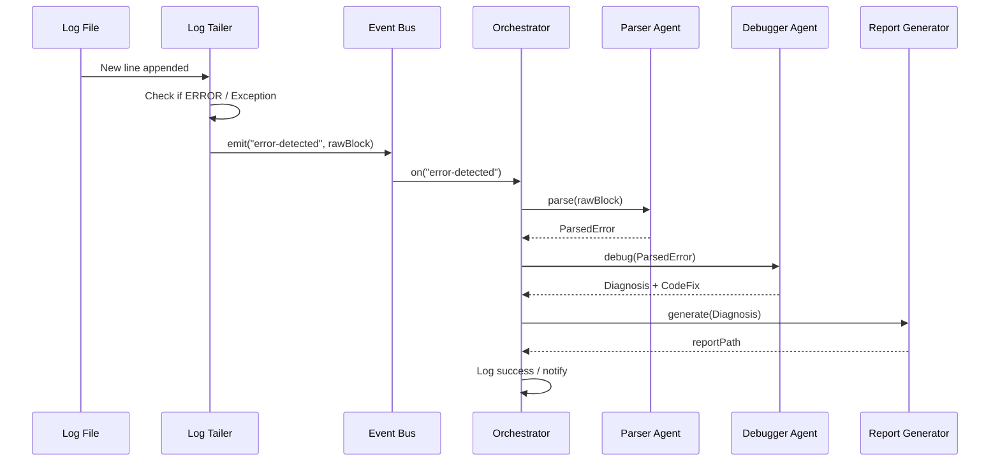
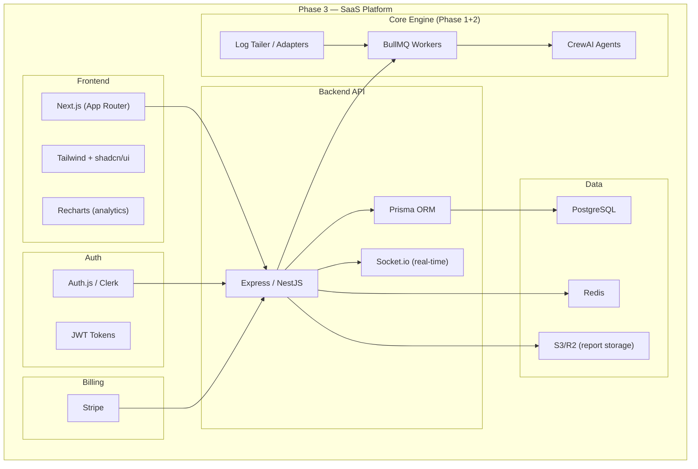

# ALAA — General Architecture

## 1. Overview

**Agentic Log Analyzer & Auto-Fixer (ALAA)** is a background service that monitors application error logs in real-time. When an error or exception is detected, a multi-agent AI pipeline kicks in to parse the trace, investigate the root cause, and produce a clear, actionable Markdown report containing diagnostics and a proposed code fix.

---

## 2. Major Components

| # | Component | Responsibility |
|---|-----------|---------------|
| 1 | **Log Tailer** | MVP log source — watches local `.log` files for new `ERROR` / `Exception` lines using `fs.watch` + `readline`, emits events via `EventEmitter`. |
| 2 | **Event Bus** | Internal `EventEmitter` that decouples log sources from downstream processing. Publishes `error-detected` events. |
| 3 | **Message Queue (BullMQ + Redis)** | Decouples log detection from AI processing. Queues allow rate-limiting LLM requests, automatic retries for transient errors, and deduplication of high-frequency identical logs. |
| 4 | **Microservice AI Layer (FastAPI)** | The heavy Python-based CrewAI logic runs isolated in its own container (`alaa-ai-service`). This cleanly separates the Node.js I/O streaming world from the Python AI/Compute world. |
| 5 | **SaaS Frontend & Database (Phase 3)** | A Next.js frontend application allows users to view parsed reports, manage credentials, and configure active log streams. A relational PostgreSQL database stores users, subscription tiers (Stripe), OAuth credentials, and long-term historical analysis reports. |
| 6 | **Report Generator** | Formats agent outputs into a readable `.md` diagnostic report and writes it to disk. |
| 7 | **Queue (Phase 2)** | BullMQ + Redis layer for robust async job handling when scaling beyond a single process. |
| 8 | **Log Source Adapters (Phase 2)** | Plug-and-play adapter layer — AWS CloudWatch, PM2, Docker, GCP, Azure, Webhook. Any adapter implementing the `LogSource` interface feeds errors into the pipeline. |

---

## 3. High-Level Data Flow

```mermaid
flowchart LR
    A["📂 .log File"] -->|fs.watch + readline| B["Log Tailer"]
    B -->|error-detected event| C["Event Bus (EventEmitter)"]
    C --> D["Orchestrator"]
    D --> E["Parser Agent (CrewAI)"]
    E -->|parsed error| F["Debugger Agent (CrewAI)"]
    F -->|diagnosis + fix| G["Report Generator"]
    G --> H["📄 report.md"]
```



---

## 4. Component Interaction — Sequence Diagram



---

## 5. Technology Stack & Rationale

### 5.1 Core Backend — Node.js + TypeScript

| Choice | Reason |
|--------|--------|
| **Node.js** | Ideal for I/O-bound, event-driven workloads like file watching and streaming. Native `EventEmitter` provides a clean Observer pattern. |
| **TypeScript** | Strict typing prevents runtime errors and improves maintainability in a multi-component system. |
| **fs.watch / chokidar** | `fs.watch` for lean MVP; upgrade to `chokidar` for cross-platform reliability if needed. |

### 5.2 AI Orchestration — CrewAI (Python)

| Choice | Reason |
|--------|--------|
| **CrewAI** | Purpose-built framework for multi-agent orchestration with role-based agents, task chaining, and built-in memory. |
| **Python sidecar** | CrewAI is Python-native. We run it as a subprocess or HTTP microservice invoked from Node.js. |
| **Ollama (MVP)** | Self-hosted LLM runner — free, no API keys, fully local. Models: `llama3`, `codellama`, `mistral`. |
| **Multi-provider (Phase 2)** | CrewAI's LiteLLM integration enables switching to OpenAI, Anthropic, Google with a single config change. |

### 5.3 Queue (Phase 2) — BullMQ + Redis

| Choice | Reason |
|--------|--------|
| **BullMQ** | Mature, TypeScript-first job queue with retries, concurrency control, and dead-letter handling. |
| **Redis** | Fast in-memory data store required by BullMQ; doubles as a rate-limiter and dedup cache. |

### 5.4 Project Structure (Proposed)

```
├── alaa-ai-service/          # Python CrewAI Microservice
│   ├── main.py               # Core orchestrator and models
│   ├── api.py                # FastAPI endpoints
│   ├── agents.py             # Agent definitions
│   ├── tasks.py              # Task definitions
│   └── requirements.txt
├── backend/                  # Node.js Core Engine
│   ├── docs/                 # Architecture & PRD documents
│   ├── src/
│   │   ├── index.ts          # Entry point
│   │   ├── config/
│   │   ├── tailer/           # Log listeners / Adapters
│   │   ├── events/
│   │   ├── orchestrator/
│   │   ├── queue/            # BullMQ 
│   │   ├── agents/
│   │   │   └── HttpAgentClient.ts # Node client to invoke CrewAI over HTTP
│   │   ├── reporter/
│   │   └── utils/
│   ├── reports/              # Generated diagnostic reports
│   ├── docker-compose.yml    # Runs Redis + alaa-ai-service
│   ├── package.json
│   ├── tsconfig.json
│   └── .env.example
├── frontend/                 # Next.js Dashboard (Phase 3)
│   ├── src/
│   │   ├── app/              # Next.js App Router Next15
│   │   ├── components/       # UI Components
│   │   └── lib/              # API Clients / Data fetchers
│   ├── package.json
│   └── tailwind.config.ts
```

---

## 6. Key Design Decisions

### 6.1 Observer Pattern for Log Watching
The Log Tailer uses Node.js `EventEmitter` to implement the Observer pattern. This ensures:
- **Loose coupling** — the tailer doesn't know about agents or reports.
- **Memory safety** — stream-based line reading avoids loading entire files into memory.
- **Extensibility** — new listeners (e.g., Slack notifier) can subscribe without modifying the tailer.

### 6.2 CrewAI as a Python Sidecar
Since CrewAI is Python-native, the cleanest integration is a **sidecar microservice** (a small Flask/FastAPI HTTP server) that the Node.js orchestrator calls over HTTP. Alternatives considered:

| Option | Verdict |
|--------|---------|
| Python subprocess (stdin/stdout) | ❌ Deprecated in Phase 8 (Slow, tight coupling) |
| HTTP microservice (FastAPI) | ✅ Fully isolated service in `alaa-ai-service`, scaled independently |
| Node.js native LLM SDK | ❌ Loses CrewAI's multi-agent orchestration benefits |

**MVP approach:** Isolated Python FastAPI microservice (`alaa-ai-service`).

### 6.3 Deduplication
Repeated identical errors should not trigger repeated analysis. A simple in-memory hash set (error signature → timestamp) with a TTL will deduplicate within a time window. Phase 2 moves this to Redis.

### 6.4 Phase 3: SaaS Data Tier

As ALAA transitions to a multi-tenant SaaS application, we implement **PostgreSQL** linked via Prisma ORM for long term data durability.

| Data Type | Storage Solution | Rationale |
|-----------|------------------|-----------|
| In-flight processing queue | Redis (BullMQ) | Blazing fast pop/push, atomic deduplication |
| User Accounts & Billing | PostgreSQL | ACID transactions, strict relational schemas |
| Historical Reports | PostgreSQL | Easy querying and pagination for user dashboard |

For the Frontend, **Next.js (App Router)** is selected alongside **TailwindCSS** for rapid, responsive UI development natively supporting server-side rendering for SEO and fast dashboard load times.

### 6.5 Plug-and-Play Log Source Adapters (Phase 2)
The Log Tailer is the MVP's concrete log source, but it implements a generic `LogSource` interface. In Phase 2, an **Adapter Registry** allows users to plug in additional log sources (AWS CloudWatch, PM2, Docker, GCP, Azure, or custom webhooks) via a simple `alaa.config.yaml` configuration file. The downstream pipeline remains entirely agnostic to the source — all adapters normalize output into the same `ErrorBlock` format. See the HLD §2.8 for full details.

### 6.6 LLM Provider Strategy
**MVP:** Ollama only — self-hosted, free, no API keys. Users run `ollama serve` locally and configure via `OLLAMA_MODEL` and `OLLAMA_BASE_URL` env vars. Recommended models: `llama3` (general), `codellama` (code-focused), `mistral` (balanced).

**Phase 2:** Multi-provider abstraction via `LLM_PROVIDER` env var. Adds support for:
- **OpenAI** — GPT-4o, GPT-4o-mini
- **Anthropic** — Claude Sonnet, Claude Haiku
- **Google** — Gemini 2.0 Flash, Gemini 2.5 Pro

Phase 2 also adds per-agent model assignment and automatic fallback chains. See HLD §2.9 for full details.

---

## 7. Non-Functional Considerations

| Concern | MVP Approach | Production Approach |
|---------|-------------|---------------------|
| **Scalability** | Single process, single log file | BullMQ workers, plug-and-play adapters for multiple log sources (AWS, PM2, Docker, etc.) |
| **Reliability** | Graceful shutdown, file offset tracking | Redis-backed offset persistence, dead-letter queue |
| **Security** | `.env` for API keys | Secrets manager (e.g., Vault), restricted file permissions |
| **Observability** | Console + file logging | Structured logging (Pino), metrics (Prometheus) |
| **Performance** | Streaming line reader, in-memory dedup | Batched AI calls, connection pooling |

---

## 8. Phase Roadmap

### Phase 1 — MVP (Current Focus)
> **Goal:** Validate the core idea — can an AI pipeline produce useful diagnostic reports from error logs?

- CLI-only background service (no UI)
- Single local `.log` file watcher
- Ollama self-hosted LLM (no API keys, fully local)
- CrewAI multi-agent pipeline (Parser + Debugger agents)
- Markdown report generation to `reports/` directory
- In-memory deduplication
- Single project, single user

---

### Phase 2 — Backend Extensibility
> **Goal:** Make ALAA production-ready and infrastructure-agnostic.

- **Multi-LLM providers** — OpenAI, Anthropic, Google, Ollama (switchable via env var)
- **Plug-and-play log source adapters** — AWS CloudWatch, PM2, Docker, GCP, Azure, Custom Webhook
- **BullMQ + Redis** — job queue for concurrent error processing
- **Per-agent model assignment** — different LLMs for Parser vs Debugger
- **Fallback chains** — automatic LLM failover
- **HTTP microservice mode** for CrewAI sidecar (independent scaling)
- **Redis-backed dedup** and offset persistence

---

### Phase 3 — SaaS Platform (Future)
> **Goal:** Transform ALAA from a CLI tool into a full SaaS product with a web dashboard, multi-tenancy, auth, and billing.

#### 3.1 Authentication & User Management
- **Auth system** — email/password + OAuth (GitHub, Google)
- **Tech options:** Auth.js (NextAuth) for Next.js integration, or Clerk for managed auth
- **JWT-based API auth** for backend endpoints
- **Role-based access control (RBAC):** Owner, Admin, Member, Viewer
- **User profile** — settings, preferences, notification config

#### 3.2 Web Dashboard (UI)
- **Tech:** Next.js (React) — SSR for SEO, App Router for modern patterns
- **Styling:** Tailwind CSS + shadcn/ui for a premium, production-ready look
- **Pages/Features:**
  - **Dashboard home** — Overview of all projects, recent errors, health status
  - **Error feed** — Real-time error stream with filtering, search, severity badges
  - **Report viewer** — Rendered Markdown reports with syntax highlighting
  - **Error trends** — Charts showing error frequency, types over time (Recharts/Chart.js)
  - **Project settings** — Configure log sources, LLM provider, notification channels
  - **Team management** — Invite members, assign roles

#### 3.3 Multi-Project & Multi-Tenancy
- **Projects** — Each user/org can create multiple projects
- **Per-project configuration:**
  - Log source(s) assignment
  - LLM provider & model selection
  - Error pattern customization
  - Notification routing (Slack channel, email, webhook per project)
- **Project isolation** — each project's data is fully isolated
- **Organization/team model** — groups of users sharing projects

#### 3.4 Database
- **PostgreSQL with Prisma ORM** — relational integrity for users, projects, teams, reports
- **Key tables:** `users`, `organizations`, `projects`, `project_members`, `error_reports`, `log_sources`, `llm_configs`, `subscriptions`, `invoices`
- **Report storage:** Markdown reports stored in DB (or S3/R2 for large volumes) with full-text search

#### 3.5 Billing & Plans (SaaS)
- **Billing provider:** Stripe (or LemonSqueezy for simplicity)
- **Plan tiers:**

| Plan | Errors/month | Projects | Team members | LLM | Price |
|------|-------------|----------|--------------|-----|-------|
| **Free** | 50 | 1 | 1 (solo) | Ollama only | $0 |
| **Pro** | 1,000 | 5 | 5 | All providers | $29/mo |
| **Team** | 10,000 | Unlimited | Unlimited | All + priority | $99/mo |
| **Enterprise** | Custom | Custom | Custom | Custom | Contact |

- **Usage tracking** — errors analyzed per billing period
- **Webhooks** — Stripe webhook handler for subscription lifecycle
- **Free tier** serves as lead gen — Ollama-only, single project, no team

#### 3.6 Notifications & Integrations
- **Slack integration** — OAuth app, post reports to channels
- **Email reports** — digest or real-time (SendGrid / Resend)
- **Webhook** — configurable POST endpoint for custom integrations
- **GitHub integration** — auto-create issues from error reports (Phase 3+)

#### 3.7 API Layer
- **REST API** (Express or NestJS) for dashboard ↔ backend communication
- **WebSocket** (Socket.io) for real-time error feed on dashboard
- **Endpoints:** Auth, projects CRUD, reports list/view, settings, billing, team management
- **API keys** — programmatic access for CI/CD integration

#### 3.8 Deployment & Infrastructure
- **Containerized** — Docker + Docker Compose for local, Kubernetes for production
- **CI/CD** — GitHub Actions for build, test, deploy
- **Hosting options:** Vercel (frontend) + Railway/Fly.io (backend) or full AWS/GCP
- **Monitoring** — Sentry for errors, Prometheus + Grafana for metrics

#### 3.9 Phase 3 Tech Stack Summary



> **📝 Note:** Phase 3 HLD/LLD will be designed in detail when we're ready to begin that work. These notes serve as a high-level blueprint to ensure Phase 1 & 2 architecture decisions don't create obstacles for the SaaS evolution.

---

## 9. Immediate Next Steps

Upon approval of this General Architecture:
1. ✅ **HLD** — detailed module specs, API contracts, data models, error-handling strategy (complete).
2. **LLD** — TypeScript interfaces, class designs, function signatures, CrewAI agent/task configs.
3. **MVP Plan** — prioritised feature list, timeline estimates, risk assessment.
