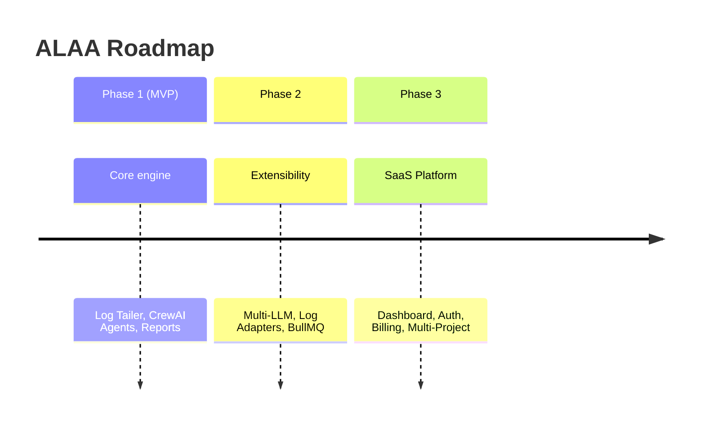

# ALAA — MVP Plan

## 1. MVP Goal

> **Validate the core idea:** Can an AI pipeline automatically produce useful diagnostic reports from application error logs?

**Success criteria:** A developer appends an error to a log file → ALAA detects it within seconds → a Markdown report with root cause and code fix appears in `reports/`.

---

## 2. Feature Prioritization

### Must Have (MVP)

| # | Feature | Module | Effort |
|---|---------|--------|--------|
| 1 | Project scaffolding (TS + Python) | Setup | S |
| 2 | Config loading + validation | Config | S |
| 3 | Pino structured logger | Logger | S |
| 4 | Typed Event Bus singleton | EventBus | S |
| 5 | Log file watcher with offset tracking | LogTailer | M |
| 6 | Error line detection (regex) | LogTailer | S |
| 7 | Context buffer (10 preceding lines) | LogTailer | S |
| 8 | Python CrewAI subprocess invocation | AgentClient | M |
| 9 | Parser Agent (CrewAI + Ollama) | CrewAI | M |
| 10 | Debugger Agent (CrewAI + Ollama) | CrewAI | M |
| 11 | Markdown report generation | ReportGen | M |
| 12 | Orchestrator pipeline (detect → parse → debug → report) | Orchestrator | M |
| 13 | SHA-256 deduplication with TTL | Orchestrator | S |
| 14 | Graceful shutdown (SIGINT/SIGTERM) | Entry | S |
| 15 | Unit tests for all modules | Tests | M |

**S** = Small (< 1 hour) · **M** = Medium (1–3 hours)

### Nice to Have (if time permits)

| # | Feature | Notes |
|---|---------|-------|
| 1 | File rotation detection | Reset offset when file is truncated |
| 2 | Exponential backoff reconnect | Watcher auto-recovery |
| 3 | Integration test with fixture file | End-to-end validation |
| 4 | Configurable error patterns | Custom regex beyond ERROR/Exception |

### Deferred to Phase 2

- Multi-LLM provider support (OpenAI, Anthropic, Google)
- Plug-and-play log source adapters (AWS, PM2, Docker)
- BullMQ + Redis job queue
- HTTP microservice mode for CrewAI
- Per-agent model assignment
- Fallback chains

---

## 3. Implementation Order

Build in dependency order — each step produces a working, testable unit.

```mermaid
gantt
    title ALAA MVP Implementation
    dateFormat  X
    axisFormat  Step %s

    section Foundation
    Project scaffolding           :s1, 0, 1
    Types + Config + Logger       :s2, 1, 2

    section Core Pipeline
    Event Bus                     :s3, 2, 3
    Log Tailer                    :s4, 3, 5
    Agent Client (subprocess)     :s5, 5, 7

    section AI Agents
    CrewAI agents + tasks (Python):s6, 7, 10

    section Orchestration
    Report Generator              :s7, 10, 11
    Orchestrator (full pipeline)  :s8, 11, 13

    section Quality
    Entry point + shutdown        :s9, 13, 14
    Unit tests                    :s10, 14, 16
    Integration test + smoke test :s11, 16, 17
```



### Step-by-Step Build Order

| Step | Files to Create | Tests | Milestone |
|------|----------------|-------|-----------|
| **1** | `package.json`, `tsconfig.json`, `.env.example`, `requirements.txt` | — | Project compiles |
| **2** | `src/types/index.ts`, `src/config/index.ts`, `src/utils/logger.ts` | `config.test.ts` | Config loads and validates |
| **3** | `src/events/EventBus.ts` | `EventBus.test.ts` | Events emit and receive |
| **4** | `src/tailer/LogTailer.ts` | `LogTailer.test.ts` | File changes trigger error-detected events |
| **5** | `src/agents/AgentClient.ts` | `AgentClient.test.ts` | Can spawn Python and exchange JSON |
| **6** | `crewai-service/main.py`, `agents.py`, `tasks.py` | Manual test (run directly) | Agents produce valid JSON output |
| **7** | `src/reporter/ReportGenerator.ts` | `ReportGenerator.test.ts` | Generates correct Markdown files |
| **8** | `src/orchestrator/Orchestrator.ts` | `Orchestrator.test.ts` | Full pipeline: detect → parse → debug → report |
| **9** | `src/index.ts` | — | `npm run dev` starts ALAA |
| **10** | All `*.test.ts` files | All unit tests pass | `npm test` — all green |
| **11** | Integration + smoke test | End-to-end validation | Append error to `system.log` → report appears |

---

## 4. Time Estimate

| Phase | Steps | Estimated Time |
|-------|-------|---------------|
| Foundation | 1–2 | 1–2 hours |
| Core Pipeline | 3–5 | 3–4 hours |
| AI Agents | 6 | 2–3 hours |
| Orchestration | 7–8 | 2–3 hours |
| Quality | 9–11 | 2–3 hours |
| **Total** | **1–11** | **10–15 hours** |

> This is a single-developer estimate. A skilled TypeScript + Python developer can complete the MVP in **2–3 focused days**.

---

## 5. Risk Assessment

| Risk | Likelihood | Impact | Mitigation |
|------|-----------|--------|------------|
| Ollama returns malformed JSON | Medium | High | Validate + retry with clearer prompt; add `output_json=True` in CrewAI tasks |
| CrewAI subprocess hangs | Low | High | 60s timeout + SIGKILL; retry with backoff |
| Ollama model too slow on weak hardware | Medium | Medium | Recommend `llama3` 8B; document minimum specs (16GB RAM) |
| `fs.watch` unreliable on some OS | Low | Medium | Use polling fallback; upgrade to `chokidar` in Phase 2 |
| Python not installed on user's machine | Medium | High | Document prerequisite; provide setup script |
| LLM hallucinated code fix | High | Medium | Show confidence score prominently; add disclaimer in report |
| Large log files cause memory issues | Low | Medium | Stream-based reading with offset; never read entire file |

---

## 6. Prerequisites

Before starting development, ensure:

```bash
# Node.js (v20+)
node --version

# Python (3.11+)
python3 --version

# Ollama installed and running
ollama --version
ollama pull llama3
ollama serve   # should be running on http://localhost:11434
```

---

## 7. Definition of Done

The MVP is **done** when:

- [ ] `npm run dev` starts ALAA and begins watching `system.log`
- [ ] Appending an ERROR line to `system.log` triggers the full pipeline
- [ ] A Markdown report appears in `reports/` within 60 seconds
- [ ] Report contains: Error Summary, Root Cause Analysis, Proposed Fix
- [ ] Duplicate errors within 5 minutes are skipped (dedup works)
- [ ] `npm test` passes all unit tests
- [ ] SIGINT/SIGTERM triggers graceful shutdown
- [ ] No memory leaks during 10-minute continuous run

---

## 8. Backend Developer Agent Prompt

> **Copy the prompt below and give it to your `/backend` agent to start development.**

---

```
@/backend Implement the MVP for the ALAA project (Agentic Log Analyzer & Auto-Fixer).

Read these architecture documents in order:
1. docs/generalArch.md — System overview and tech stack
2. docs/hld.md — Module specifications (focus on sections 2.1 through 2.7 only — those are MVP scope)
3. docs/lld.md — Full implementation specs with TypeScript code and Python CrewAI code

Key instructions:
- Follow the LLD code EXACTLY — it has complete implementations for every module
- Build in the step-by-step order defined in docs/mvpPlan.md Section 3
- Use TypeScript + Node.js for the core (no Express, it's a CLI background service)
- Use Python + CrewAI for the AI agents (subprocess mode)
- Use Ollama as the LLM provider (self-hosted, no API keys)
- Use Pino for logging, Vitest for testing
- Write unit tests for every module as specified in the LLD Section 14
- After each step, verify it works before moving to the next

Prerequisites (must be running):
- Node.js v20+
- Python 3.11+ with crewai installed (pip install crewai crewai-tools)
- Ollama running locally with llama3 model pulled

The project already has a sample system.log file you can use for testing.
Final smoke test: append an ERROR line to system.log and verify a report appears in reports/.
```

---

## 9. Production Roadmap (Post-MVP)



| Phase | Key Additions | Priority |
|-------|-------------|----------|
| **Phase 2** | Multi-LLM (OpenAI, Claude, Gemini), Log adapters (AWS, PM2, Docker), BullMQ queue, HTTP mode for CrewAI | High |
| **Phase 3** | Next.js dashboard, PostgreSQL, Auth (OAuth + RBAC), Stripe billing, Teams, Slack/email notifications | Medium |
