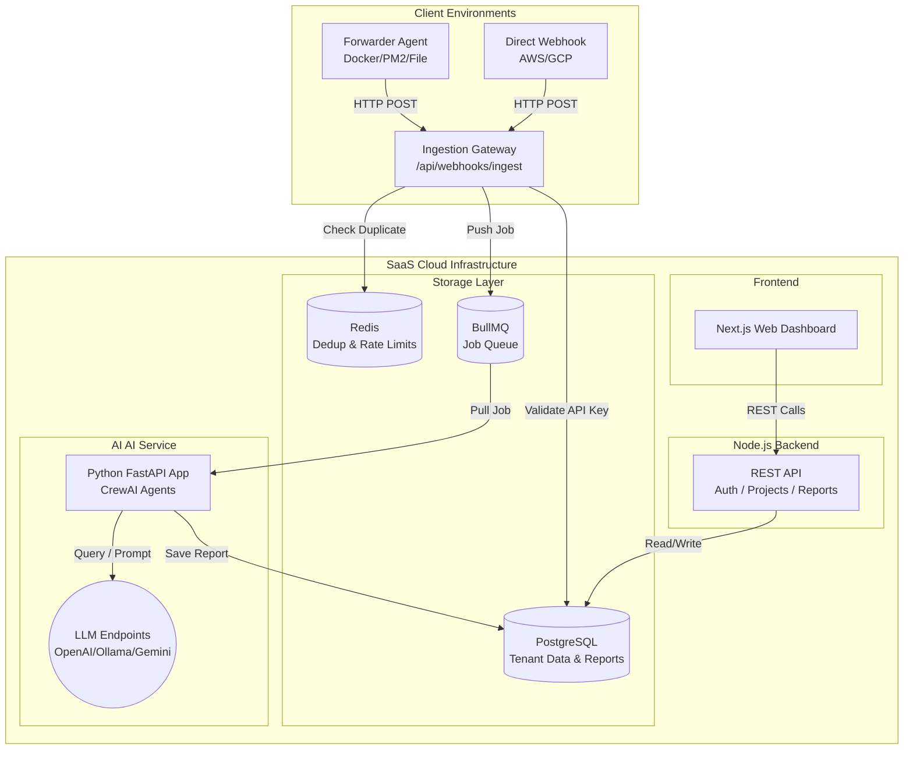
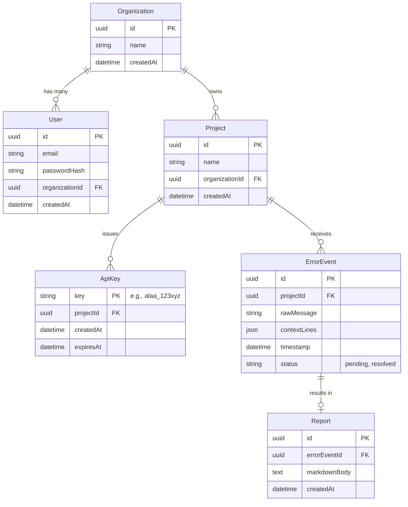

# High-Level Design (HLD) — ALAA SaaS Platform

## 1. System Overview

ALAA (Agentic Log Analyzer & Auto-Fixer) is transitioning from a standalone, single-tenant CLI application into a **Multi-Tenant SaaS Platform**. The platform allows engineering teams to forward their application logs to a centralized cloud service where AI models autonomously analyze errors, deduplicate noise, and generate comprehensive debugging reports.

### Key Capabilities
- **Multi-Tenancy:** Support for multiple Organizations, each managing multiple Projects.
- **Centralized Ingestion:** A high-throughput webhook endpoint that ingests error logs validated via per-Project API Keys.
- **Distributed Processing:** A scalable, queue-driven AI analysis pipeline separating the Node.js ingestion gateway from the Python AI heavy-lifting.
- **Web Dashboard:** A modern UI for teams to view, filter, and act upon AI-generated debugging reports.

---

## 2. Architecture Architecture



---

## 3. Core Components Detailed Breakdown

To transform into a highly scalable SaaS platform, the architecture is split into four distinct layers. Each layer has specific, decoupled responsibilities to ensure the system can scale under heavy load.

### 3.1 SaaS Backend (Node.js / Express / Prisma)
**Layer Type:** Ingestion Gateway & REST API
**Purpose:** This is the high-throughput gateway of the system. It handles all incoming traffic from user environments and serves the Web Dashboard. Not meant for long-running computation.
**Why Node.js?:** Node.js excels at handling massive amounts of asynchronous I/O (like thousands of simultaneous incoming HTTP webhooks) with low memory overhead.
- **Detailed Responsibilities:**
  - **Ingestion (`/api/webhooks/ingest`):** Rapidly receives POST requests containing error logs. It immediately validates the `x-api-key` against PostgreSQL to ensure the request belongs to an active, paying Customer and associates it with the correct `ProjectId`.
  - **Deduplication (Redis):** Executes the `RedisDedupeService`. If an identical error hash for the same `ProjectId` was seen in the last 5 minutes, it drops the request instantly. This prevents log floods from crippling the AI service.
  - **Queueing (BullMQ):** If the error is unique and valid, it creates a lightweight job on the Redis queue and returns `202 Accepted` to the client. It *does not* wait for the AI to process the error.
  - **Dashboard APIs:** Serves standard RESTful endpoints to the Frontend for Auth, Project Management, and fetching Reports via Prisma ORM querying PostgreSQL.

### 3.2 SaaS Web UI (Next.js or React)
**Layer Type:** Client Presentation
**Purpose:** The interactive web application where engineering teams collaborate, view errors, and read the AI's debugging reports.
**Use Case:** Provides the physical "SaaS experience" missing from the CLI tool.
- **Detailed Responsibilities:**
  - **Authentication:** Provides Login, Registration, and Password Reset screens leveraging secure JWTs.
  - **Tenant Management:** Allows users to create new "Projects" (e.g., separating logs for their "Frontend Server" vs "Backend API"). 
  - **Key Management:** A secure UI for users to generate, view, and revoke the unique API keys needed by the Forwarder Agents.
  - **Real-Time Feed:** Consumes the backend APIs to display a feed of active `ErrorEvents` and renders the rich, Markdown-formatted `Reports` produced by the Python AI Layer.

### 3.3 The Forwarder Agent (npm package / CLI binary)
**Layer Type:** Edge Data Collector
**Purpose:** A lightweight integration application that customers install in their own AWS, GCP, or bare-metal servers. It extracts logs at the source and "pushes" them to our cloud.
**Use Case:** The ALAA SaaS servers cannot reach into a customer's private, firewalled database/servers to "pull" logs. The customer must "push" the logs out to us.
- **Detailed Responsibilities:**
  - Runs as a daemon or background process alongside the customer's application.
  - Continuously tails standard output sources like `Docker`, `PM2`, or local `.log` files.
  - Applies a fast Regex filter locally to detect `ERROR`, `Exception`, or `FATAL` keywords.
  - Collects surrounding context lines and fires an HTTP POST to our SaaS Ingestion Gateway (`/api/webhooks/ingest`), attaching the customer's `x-api-key` in the header for authentication.

### 3.4 AI Service (Python / FastAPI / CrewAI)
**Layer Type:** Asynchronous Processing & AI Orchestration
**Purpose:** The heavy-lifting intelligence engine. Separated from the Node.js backend because interacting with LLMs takes time (seconds to minutes) and would block the event loop of a Node.js web server. 
**Why Python?:** Python is the industry standard for AI orchestration and has the best support for CrewAI, LiteLLM, and data processing libraries.
- **Detailed Responsibilities:**
  - **Job Polling:** Continuously listens to BullMQ for new `ErrorEvent` jobs placed there by the Node.js ingestion gateway.
  - **Multi-Agent Orchestration:** When a job arrives, it spun up the `ParserAgent` to clean the stack trace and the `DebuggerAgent` to consult the LLM for a root-cause analysis.
  - **State Persistence:** Once the AI finishes generating the Markdown report, this Service directly executes an `INSERT` command into PostgreSQL, attaching the `Report` to the original `ErrorEvent` row so it immediately becomes visible on the SaaS Web UI.

---

## 4. Database Schema (PostgreSQL)

The system introduces persistent state via PostgreSQL managed by Prisma ORM.



---

## 5. Key API Contracts

### 5.1 Ingestion Webhook (Forwarder ➔ Backend)
**`POST /api/webhooks/ingest`**
- **Headers:** `x-api-key: <PROJECT_API_KEY>`
- **Body:**
  ```json
  {
    "source": "docker://my-app",
    "rawBlock": "Exception: Connection Timeout",
    "timestamp": "2026-02-28T00:00:00Z",
    "contextLines": ["line 1", "line 2"]
  }
  ```
- **Behavior:** 
  1. Lookup `$PROJECT_API_KEY` in DB. Abort 401 if invalid.
  2. Hash `rawBlock`. Check Redis for `dedup:{projectId}:{hash}`. Abort 202 if duplicate.
  3. Create `ErrorEvent` in Postgres.
  4. Push to BullMQ stringified payload.

### 5.2 Dashboard APIs (Frontend ➔ Backend)

**`POST /api/auth/register` & `POST /api/auth/login`**
- Standard Email/Password returning JWT.

**`GET /api/projects`**
- Returns all projects belonging to the User's Organization.

**`POST /api/projects/:id/api-keys`**
- Generates a new cryptographically secure API Key for the specific project.

**`GET /api/projects/:id/events`**
- Paginated list of recent `ErrorEvents` and their status.

**`GET /api/events/:id/report`**
- Fetches the AI-generated `Report` markdown for a specific event.

---

## 6. Non-Functional Requirements

- **Security:** API Keys must be cryptographically generated and securely stored (hashed if necessary, though read-often keys are typically stored plain or symmetrically encrypted depending on threat model; MVP will use indexed plain strings with high entropy). JWT for dashboard sessions.
- **Scalability:** The NodeJS ingestion layer must be stateless (besides Redis) to scale horizontally under log flood conditions.
- **Reliability:** Redis is mandatory. If Redis goes down, Deduplication fails open (allows all logs) but logs a severe alert, relying on the Queue to buffer the load.
