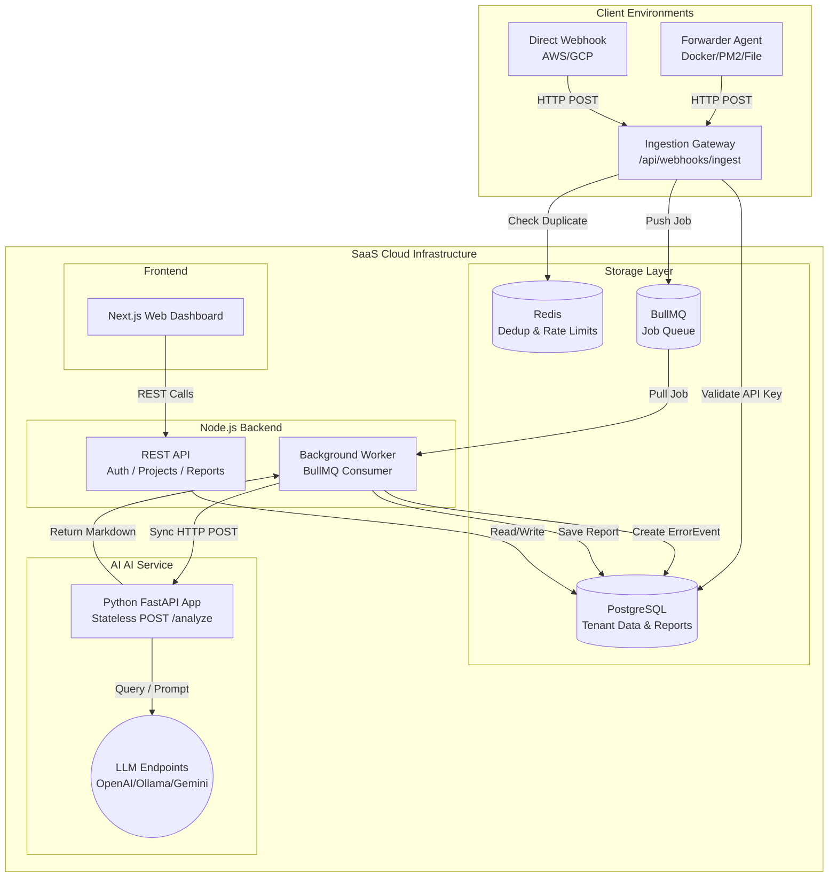
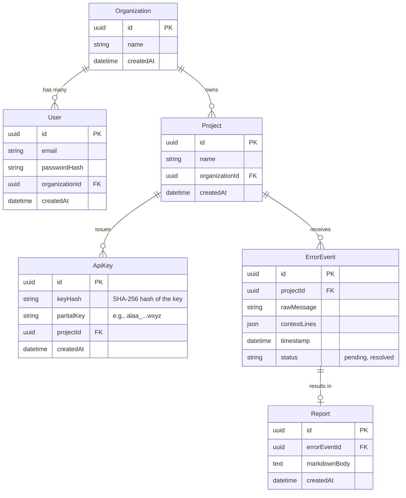

# High-Level Design (HLD) — ALAA SaaS Platform

## 1. System Overview

ALAA (Agentic Log Analyzer & Auto-Fixer) is transitioning from a standalone, single-tenant CLI application into a **Multi-Tenant SaaS Platform**. The platform allows engineering teams to forward their application logs to a centralized cloud service where AI models autonomously analyze errors, deduplicate noise, and generate comprehensive debugging reports.

### Key Capabilities
- **Multi-Tenancy:** Support for multiple Organizations, each managing multiple Projects.
- **Centralized Ingestion:** A high-throughput webhook endpoint that ingests error logs validated via per-Project API Keys.
- **Distributed Processing:** A scalable, queue-driven AI analysis pipeline separating the Node.js ingestion gateway from the Python AI heavy-lifting.
- **Web Dashboard:** A modern UI for teams to view, filter, and act upon AI-generated debugging reports.

---

## 2. Architecture Architecture



---

## 3. Core Components Detailed Breakdown

To transform into a highly scalable SaaS platform, the architecture is split into four distinct layers. Each layer has specific, decoupled responsibilities to ensure the system can scale under heavy load.

### 3.1 SaaS Backend (Node.js / Express / Prisma)
**Layer Type:** Ingestion Gateway, REST API, & Background Worker
**Purpose:** This is the core operational engine. It handles all incoming webhooks, serves the Dashboard APIs, and manages all state mutation via Prisma.
**Why Node.js?:** Node.js excels at asynchronous I/O. Its event-driven nature easily handles thousands of simultaneous webhooks, queue connections, and HTTP requests to the AI without blocking.
- **Detailed Responsibilities:**
  - **Ingestion (`/api/webhooks/ingest`):** Rapidly receives POST requests. Hashes the incoming `x-api-key` and strictly validates against a unique, indexed hash column in PostgreSQL. 
  - **Deduplication (Redis):** Executes the `RedisDedupeService` first. If an identical error hash for the same `ProjectId` was seen recently, it drops the request.
  - **Queueing (BullMQ):** To prevent database connection exhaustion during log bursts, the gateway **does not** immediately execute an `INSERT` into PostgreSQL. It pushes the raw log payload straight to BullMQ and quickly returns `202 Accepted`.
  - **Background Worker:** A dedicated Node.js worker pulls jobs from BullMQ. It safely inserts the `ErrorEvent` into PostgreSQL, makes a synchronous HTTP POST to the Python AI Service, and upon receiving the Markdown response, saves the final `Report` to PostgreSQL.
  - **Dashboard APIs:** Serves standard RESTful endpoints to the Frontend. All routes enforce strict logical data isolation by consistently applying `where: { projectId: currentContextProjectId }` via Prisma.

### 3.2 SaaS Web UI (Next.js or React)
**Layer Type:** Client Presentation
**Purpose:** The interactive web application where engineering teams collaborate, view errors, and read the AI's debugging reports.
**Use Case:** Provides the physical "SaaS experience" missing from the CLI tool.
- **Detailed Responsibilities:**
  - **Authentication:** Provides Login, Registration, and Password Reset screens leveraging secure JWTs.
  - **Tenant Management:** Allows users to create new "Projects" (e.g., separating logs for their "Frontend Server" vs "Backend API"). 
  - **Key Management:** A secure UI for users to generate, view, and revoke the unique API keys needed by the Forwarder Agents.
  - **Real-Time Feed:** Consumes the backend APIs to display a feed of active `ErrorEvents` and renders the rich, Markdown-formatted `Reports` produced by the Python AI Layer.

### 3.3 The Forwarder Agent (npm package / CLI binary)
**Layer Type:** Edge Data Collector
**Purpose:** A lightweight integration application that customers install in their own AWS, GCP, or bare-metal servers. It extracts logs at the source and "pushes" them to our cloud.
**Use Case:** The ALAA SaaS servers cannot reach into a customer's private, firewalled database/servers to "pull" logs. The customer must "push" the logs out to us.
- **Detailed Responsibilities:**
  - Runs as a daemon or background process alongside the customer's application.
  - Continuously tails standard output sources like `Docker`, `PM2`, or local `.log` files.
  - Applies a fast Regex filter locally to detect `ERROR`, `Exception`, or `FATAL` keywords.
  - Collects surrounding context lines and fires an HTTP POST to our SaaS Ingestion Gateway (`/api/webhooks/ingest`), attaching the customer's `x-api-key` in the header for authentication.

### 3.4 AI Service (Python / FastAPI / CrewAI)
**Layer Type:** Stateless AI Processing Engine
**Purpose:** A completely decoupled and stateless microservice designed purely to orchestrate LLMs and generate debugging reports on demand.
**Why Python?:** Python is the industry standard for AI orchestration and has the best support for CrewAI, LiteLLM, and data processing libraries.
- **Detailed Responsibilities:**
  - **Stateless Endpoint (`POST /analyze`):** Exposes a simple internal HTTP endpoint. It receives the stack trace and log context directly from the Node.js Background Worker.
  - **Multi-Agent Orchestration:** It spins up the `ParserAgent` to clean the stack trace and the `DebuggerAgent` to consult the LLM for a root-cause analysis based on the error context.
  - **Direct Response:** Retries and timeouts are handled completely by the Node.js worker layer. The Python service simply executes the CrewAI process and returns the fully formatted Markdown report back as its HTTP response payload. It has absolutely zero database or queue connections.

---

## 4. Database Schema (PostgreSQL)

The system introduces persistent state via PostgreSQL managed by Prisma ORM.



---

## 5. Key API Contracts

### 5.1 Ingestion Webhook (Forwarder ➔ Backend)
**`POST /api/webhooks/ingest`**
- **Headers:** `x-api-key: <PROJECT_API_KEY>`
- **Body:**
  ```json
  {
    "source": "docker://my-app",
    "rawBlock": "Exception: Connection Timeout",
    "timestamp": "2026-02-28T00:00:00Z",
    "contextLines": ["line 1", "line 2"]
  }
  ```
- **Behavior:** 
  1. Hash incoming `$PROJECT_API_KEY` and lookup against DB (`keyHash`). Abort 401 if invalid.
  2. Hash `rawBlock`. Check for `dedup:{projectId}:{hash}` in Redis. Abort 202 if duplicate.
  3. Push payload to BullMQ. *(Immediate DB inserts are bypassed to protect the connection pool from burst traffic).*
  4. Return `202 Accepted`.

### 5.2 Dashboard APIs (Frontend ➔ Backend)

**`POST /api/auth/register` & `POST /api/auth/login`**
- Standard Email/Password returning JWT.

**`GET /api/projects`**
- Returns all projects belonging to the User's Organization.

**`POST /api/projects/:id/api-keys`**
- Generates a new cryptographically secure API Key for the specific project.

**`GET /api/projects/:id/events`**
- Paginated list of recent `ErrorEvents` and their status.

**`GET /api/events/:id/report`**
- Fetches the AI-generated `Report` markdown for a specific event.

---

## 6. Non-Functional Requirements & Mitigation Strategies

- **API Key Security (Critical):** API keys must be treated like user passwords. They are generated cryptographically, shown to the user exactly once on the dashboard, and stored uniquely as a one-way hash (SHA-256) in PostgreSQL. The ingestion webhook hashes incoming header values to compare against the database.
- **Multi-Tenant Data Isolation:** For MVP scale, standard logical separation is used over PostgreSQL Row-Level Security (RLS). Strict data access patterns will enforce `where: { projectId: X }` constraints across all ORM queries to prevent tenant leakage.
- **Log Burst Resilience:** The ingestion gateway never executes synchronous ORM inserts for incoming logs. To prevent database connection exhaustion, payloads are deduplicated via Redis and buffered entirely via BullMQ queueing. The Node.js Background Worker handles the DB inserts and AI coordination at a steady, controlled rate, leveraging BullMQ's exponential backoff to recover gracefully if the Stateless AI Service or external LLMs encounter transient rate limits.
- **Data Retention & Pruning:** To prevent PostgreSQL bloat over time and maintain high query performance, a scheduled background job (e.g., node-cron or BullMQ repeatable job) will routinely prune stale data (e.g., `DELETE FROM ErrorEvents WHERE createdAt < NOW() - INTERVAL '30 days'`).
