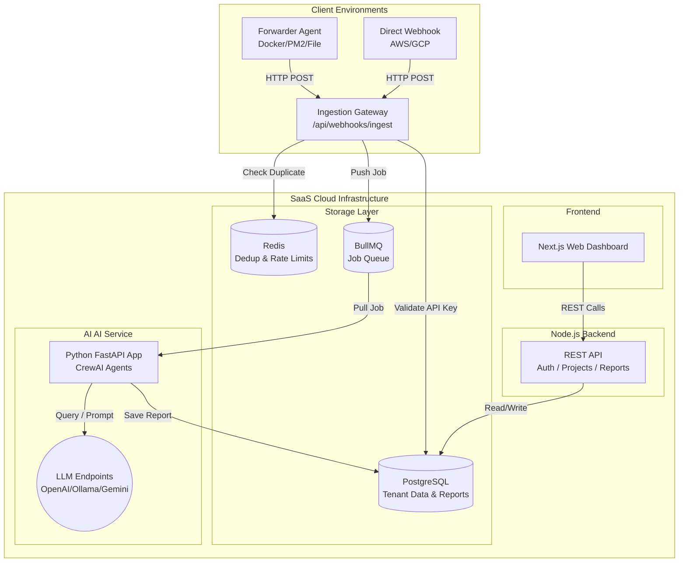
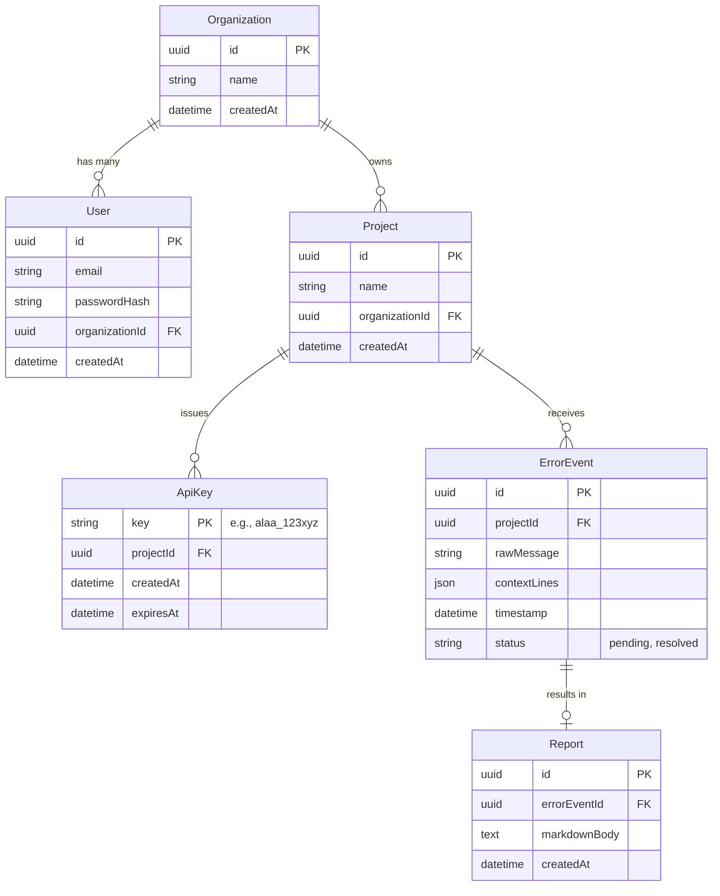

# High-Level Design (HLD) — ALAA SaaS Platform

## 1. System Overview

ALAA (Agentic Log Analyzer & Auto-Fixer) is transitioning from a standalone, single-tenant CLI application into a **Multi-Tenant SaaS Platform**. The platform allows engineering teams to forward their application logs to a centralized cloud service where AI models autonomously analyze errors, deduplicate noise, and generate comprehensive debugging reports.

### Key Capabilities
- **Multi-Tenancy:** Support for multiple Organizations, each managing multiple Projects.
- **Centralized Ingestion:** A high-throughput webhook endpoint that ingests error logs validated via per-Project API Keys.
- **Distributed Processing:** A scalable, queue-driven AI analysis pipeline separating the Node.js ingestion gateway from the Python AI heavy-lifting.
- **Web Dashboard:** A modern UI for teams to view, filter, and act upon AI-generated debugging reports.

---

## 2. Architecture Architecture



---

## 3. Core Components

### 3.1 SaaS Backend (Node.js / Express / Prisma)
The central nervous system of the platform.
- **Responsibilities:**
  - Expose the `/api/webhooks/ingest` endpoint for log forwarding.
  - Authenticate and authorize requests against PostgreSQL via Prisma.
  - Implement the `RedisDedupeService` to enforce project-scoped deduplication logs to prevent flood attacks.
  - Publish valid, unique `ErrorEvents` to BullMQ.
  - Serve RESTful APIs to the Next.js frontend (e.g., fetching lists of Projects, rotating API keys, retrieving Reports).

### 3.2 SaaS Web UI (Next.js or React+Vite)
The user-facing dashboard.
- **Responsibilities:**
  - Login / Registration (JWT based).
  - Organization and Project management.
  - API Key generation and rotation (1 Key per Project).
  - Real-time Error Feed displaying active issues and their resolution status.
  - Detailed Report Viewer rendering the Markdown output generated by the AI service.

### 3.3 The Forwarder Agent (npm package / CLI binary)
Extracts the existing `DockerLogSource`, `PM2LogSource`, and `FileLogSource` out of the monolithic backend.
- **Responsibilities:**
  - Runs inside the customer's infrastructure.
  - Tails local logs.
  - Detects `ERROR` or `Exception` patterns.
  - Packages the context lines and executes an HTTP POST to the SaaS Ingestion Gateway, authenticating via the configured `x-api-key`.

### 3.4 AI Service (Python / FastAPI / CrewAI)
The asynchronous intelligence layer.
- **Responsibilities:**
  - Actively polls BullMQ for pending ErrorEvents.
  - Orchestrates the `ParserAgent` and `DebuggerAgent` to analyze the stack trace.
  - Writes the final Markdown `Report` row back directly into PostgreSQL, attaching it to the `ErrorEvent` and associating it with the correct `ProjectId`.

---

## 4. Database Schema (PostgreSQL)

The system introduces persistent state via PostgreSQL managed by Prisma ORM.



---

## 5. Key API Contracts

### 5.1 Ingestion Webhook (Forwarder ➔ Backend)
**`POST /api/webhooks/ingest`**
- **Headers:** `x-api-key: <PROJECT_API_KEY>`
- **Body:**
  ```json
  {
    "source": "docker://my-app",
    "rawBlock": "Exception: Connection Timeout",
    "timestamp": "2026-02-28T00:00:00Z",
    "contextLines": ["line 1", "line 2"]
  }
  ```
- **Behavior:** 
  1. Lookup `$PROJECT_API_KEY` in DB. Abort 401 if invalid.
  2. Hash `rawBlock`. Check Redis for `dedup:{projectId}:{hash}`. Abort 202 if duplicate.
  3. Create `ErrorEvent` in Postgres.
  4. Push to BullMQ stringified payload.

### 5.2 Dashboard APIs (Frontend ➔ Backend)

**`POST /api/auth/register` & `POST /api/auth/login`**
- Standard Email/Password returning JWT.

**`GET /api/projects`**
- Returns all projects belonging to the User's Organization.

**`POST /api/projects/:id/api-keys`**
- Generates a new cryptographically secure API Key for the specific project.

**`GET /api/projects/:id/events`**
- Paginated list of recent `ErrorEvents` and their status.

**`GET /api/events/:id/report`**
- Fetches the AI-generated `Report` markdown for a specific event.

---

## 6. Non-Functional Requirements

- **Security:** API Keys must be cryptographically generated and securely stored (hashed if necessary, though read-often keys are typically stored plain or symmetrically encrypted depending on threat model; MVP will use indexed plain strings with high entropy). JWT for dashboard sessions.
- **Scalability:** The NodeJS ingestion layer must be stateless (besides Redis) to scale horizontally under log flood conditions.
- **Reliability:** Redis is mandatory. If Redis goes down, Deduplication fails open (allows all logs) but logs a severe alert, relying on the Queue to buffer the load.
